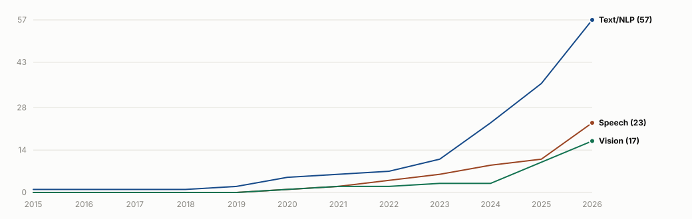
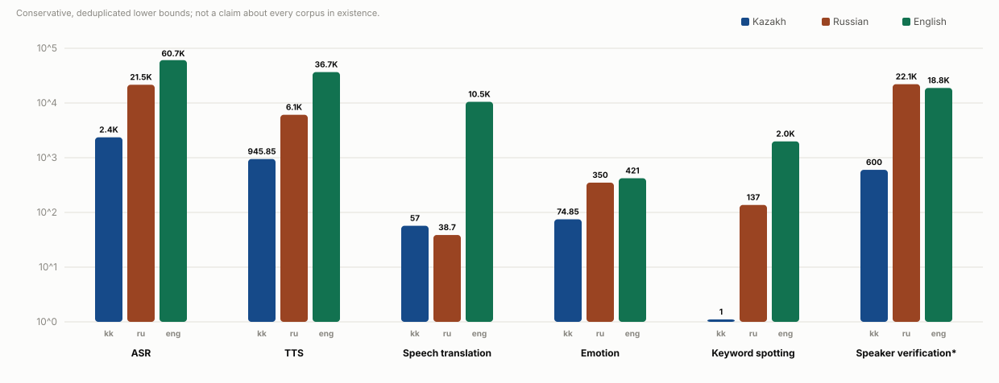

<h1 align="center">
  
  Awesome Kazakh Datasets
  
</h1>

  A curated, verified catalog of public datasets for Kazakh-language NLP, LLM, speech, and vision research.

<!-- BADGES:START -->

  
  
  
  

<!-- BADGES:END -->

  <a href="#about">About</a> ·
  <a href="#text-nlp-and-llm">Text &amp; NLP</a> ·
  <a href="#speech-and-audio">Speech</a> ·
  <a href="#vision-ocr-and-multimodal">Vision &amp; OCR</a> ·
  <a href="#watchlist--announced-resources">Watchlist</a> ·
  <a href="#contributing">Contributing</a> ·
  <a href="#license">License</a>

---

## About

Kazakh is spoken by roughly 13 million people, yet reusable public datasets for it
are scattered across Hugging Face, GitHub, institutional pages, and archives with
no reliable map of what's actually downloadable today.

Every entry below is checked against its primary source, with release date, access
terms, and license recorded rather than assumed. Resources that are announced but
not yet independently verifiable go in the [Watchlist](#watchlist--announced-resources)
instead of the main tables. See [CONTRIBUTING.md](CONTRIBUTING.md) for the full
inclusion policy and [CHANGELOG.md](CHANGELOG.md) for what's new.

<!-- LANDSCAPE:START -->
<picture>
  <source media="(prefers-color-scheme: dark)" srcset="assets/dataset_growth-dark.svg">
  
</picture>

Cumulative Kazakh dataset releases over time, by section.
<!-- LANDSCAPE:END -->

## Text, NLP, and LLM

<!-- NLP_SECTION:START -->

| ID | Released | Dataset | Task | Description | Storage | Samples |
|---:|---|---|---|---|---|---|
| 1 | 2026-06 | **[FreshQA Kazakh](https://huggingface.co/datasets/issai/freshqa_kazakh)** ISSAI researchers Open | QA | Bilingual (English/Kazakh) benchmark of factual questions with false premises, for testing how models handle incorrect assumptions. | 0.4 MB | 600 |
| 2 | 2026-06 | **[DeFAn Kazakh](https://huggingface.co/datasets/issai/defan_kazakh)** ISSAI researchers Open | QA | Machine-translated Kazakh/English version of the DefAn hallucination benchmark for definitive question answering. | 0.2 MB | 3,178 questions |
| 3 | 2026-06 | **[Kazakh Open Retrieval Benchmark](https://huggingface.co/datasets/Tim2190/kaz-rag-search-benchmark)** [Timur Seidalin](https://doi.org/10.5281/zenodo.20605663) Open | RAG · QA | Evidence-based Kazakh information-retrieval benchmark built from Kazakh Wikipedia, showing morphological stemming outperforms multilingual embeddings. | 14.6 MB | 300 queries; 8,370 passages |
| 4 | 2026-06 | **[Til-Corpus](https://huggingface.co/datasets/TilQazyna/Til-Corpus)** Til-Qazyna Gated | LM | Kazakh-centered, quality-tiered text corpus for language-model pretraining, with Russian, English, and mixed-language material. | 204.2 GB | 58,850,639 documents |
| 5 | 2026-06 | **[Til-Instruct](https://huggingface.co/datasets/TilQazyna/Til-Instruct)** Til-Qazyna Gated | IFT | Unified, model-judged and quality-tiered Kazakh-focused instruction-tuning collection assembled from TilQazyna SFT sources. | 8.35 GB | 2,563,966 raw; 2,114,016 clean; 1,581,787 premium (≈6.26M rows total) |
| 6 | 2026-06 | **[Til-Books](https://huggingface.co/datasets/TilQazyna/Til-Books)** Til-Qazyna Gated | LM | Two-layer full-text book corpus with exact extraction/OCR and cleaned reading text for Kazakh language modelling. | 2.02 GB | 16,847 books; 13,194 Kazakh |
| 7 | 2026-06 | **[Til-Parallel](https://huggingface.co/datasets/TilQazyna/Til-Parallel)** Til-Qazyna Gated | LM | Large quality-tiered multilingual corpus centered on Kazakh, with Russian and English material. | 72.16 GB | 23,294,865 rows |
| 8 | 2026-06 | **[Til-Morphology](https://huggingface.co/datasets/TilQazyna/Til-Morphology)** Til-Qazyna Gated | MORPH | Kazakh morphological-analysis collection with word segmentation and morpheme-count fields, quality-tiered by model judging. | 207.8 MB | 3,767,518 analyses |
| 9 | 2026-06 | **[Til-Classification](https://huggingface.co/datasets/TilQazyna/Til-Classification)** Til-Qazyna Gated | TC | Quality-tiered Kazakh-focused text-classification collection with labels, tasks, provenance, and model-judge scores. | 15.1 MB | 91,766 rows |
| 10 | 2026-06 | **[Til-Terminology](https://huggingface.co/datasets/TilQazyna/Til-Terminology)** Til-Qazyna Gated | LM | Quality-tiered terminology-focused text collection for Kazakh language research and text generation/pretraining. | 5.7 MB | 317,277 rows |
| 11 | 2026-06 | **[Til-Web-Raw-KK-v1](https://huggingface.co/datasets/TilQazyna/Til-Web-Raw-KK-v1)** Til-Qazyna Gated | LM | Raw HTML mirror of two Kazakh educational and Q&A websites (bilim-all.kz, surak.baribar.kz) — server-rendered pages, images, and attachments collected before text extraction/cleaning, as source material for the Til foundation-model program. | 19.5 GB | ≈222,890 pages |
| 12 | 2026-05 | **[KazLawBench](https://huggingface.co/datasets/raiym76/kazlawbench)** Batyr Raiym Gated | LQA | First bilingual (Russian + Kazakh) legal-LLM benchmark for Kazakhstan, spanning statutory codes and de-identified Supreme Court judgments across seven task types. | 9.9 MB | 3,098 |
| 13 | 2026-05 | **[100k Movie Reviews from Kazakhstan](https://huggingface.co/datasets/yeshpanovrustem/100k_movie_reviews_from_kz)** [Rustem Yeshpanov](https://arxiv.org/abs/2605.08600) Gated | SC | 100,502 kino.kz movie reviews (2001-2025) manually annotated for language ID and sentiment, capturing Russian, Kazakh, and code-switched Kazakh-Russian text. | 57.7 MB | 100,502 reviews |
| 14 | 2026-04 | **[Zerde-QA-50K](https://huggingface.co/datasets/kurumikz/Zerde-QA-50K)** kurumikz Open | IFT · QA | Synthetic Kazakh QA collection spanning 20+ academic domains for instruction tuning and low-resource NLP research. | 156.2 MB | 51,422 pairs |
| 15 | 2026-03 | **[RAGBench Kazakh](https://huggingface.co/datasets/issai/RAGBench_Kazakh)** ISSAI researchers Open | RAG | Kazakh translation of RAGBench for evaluating retrieval-augmented-generation systems across biomedical, legal, financial, and general-knowledge domains. | 31.2 MB | 11,431 |
| 16 | 2026-03 | **[IFBench Kazakh](https://huggingface.co/datasets/issai/IFBench_Kazakh)** ISSAI researchers Open | IF | Machine-translated Kazakh instruction-following benchmark evaluating adherence to explicit constraints. | 1.3 MB | 444 |
| 17 | 2026-02 | **[Kazakh Analytical RAG (Single-Document)](https://huggingface.co/datasets/farabi-lab/KZ-RAG-single-docs-final-gold)** [Kadyrbek et al.](https://doi.org/10.3390/bdcc9050137) Gated | RAG · QA | High-density Kazakh analytical question-answering collection with single-document context, for retrieval-augmented generation research. | 33.4 MB | 4,522 examples; ≈5.98M words |
| 18 | 2026-02 | **[Content Moderation and Safety — Kazakh](https://huggingface.co/datasets/farabi-lab/Content-Moderation-and-Safety)** [Kadyrbek et al.](https://doi.org/10.3390/bdcc9050137) Gated | Safety · TC | Kazakh content-moderation and safety dataset with toxicity categories, severity labels, domain tags, and constructive de-escalating responses. | 9.3 MB | 17,827 examples; ≈1.67M words |
| 19 | 2026-02 | **[Multi-Step Reasoning for Kazakh Context](https://huggingface.co/datasets/farabi-lab/multi_step_reasoning_kazakh_context)** [Kadyrbek et al.](https://doi.org/10.3390/bdcc9050137) Gated | QA | Kazakh question-answering and instruction collection centered on complex multi-step reasoning and culturally grounded analysis. | 39.0 MB | 10,981 examples; ≈6.65M words |
| 20 | 2025-12 | **[MMLU-Pro Kazakh/Russian](https://huggingface.co/datasets/issai/MMLU-Pro_Kazakh_Russian)** ISSAI researchers Open | MCQA | Machine-translated Kazakh/Russian version of MMLU-Pro, with more answer options and more challenging reasoning tasks than MMLU. | 11.4 MB | 24,064 rows; 12k per language |
| 21 | 2025-10 | **[KazCulture](https://huggingface.co/datasets/issai/KazCulture)** ISSAI researchers Gated | CQA | Human-written passage-question-answer triplets covering Kazakh traditions, music, beliefs, cuisine, games, clothing, and handicrafts. | 4.6 MB | 16,137 PQA triplets |
| 22 | 2025-07 | **[HPLT 3.0 Kazakh](https://huggingface.co/datasets/HPLT/HPLT3.0)** HPLT project Open | LM | Kazakh Cyrillic subset of HPLT 3.0, a large multilingual web-crawl corpus for language-model pretraining. | Not reported | ≈5.12M documents; ≈100.6M segments; ≈7.34B tokens |
| 23 | 2025-05 | **[Qorgau](https://github.com/mbzuai-nlp/qorgau-kaz-ru-safety)** [MBZUAI NLP group](https://arxiv.org/abs/2502.13640) Open | Safety | Kazakh/Russian bilingual LLM-safety evaluation benchmark spanning six high-level risk areas and 17 harm types. | 103.9 MB | 2,790 prompts |
| 24 | 2025-03 | **[KazakhTextDuplicates v2.0](https://huggingface.co/datasets/Arailym-tleubayeva/KazakhTextDuplicates)** [Arailym Tleubayeva](https://www.mdpi.com/2306-5729/11/6/133) Open | STS | Controlled multi-regime benchmark for semantic deduplication, semantic similarity, and retrieval in Kazakh, with seven deterministic duplication regimes. | 217 MB | 25,922 rows |
| 25 | 2025-02 | **[Kazakh-IFT](https://huggingface.co/datasets/nurkhan5l/kazakh-ift)** [Laiyk et al.](https://arxiv.org/abs/2502.13647) Gated | IFT | Instruction-following dataset covering Kazakhstani governance, legal process, cultural practice, and public-service knowledge, LLM-generated with GPT-4o. | 7.85 MB | ~10,600 samples |
| 26 | 2025-01 | **[KazMMLU](https://huggingface.co/datasets/MBZUAI/KazMMLU)** [Togmanov et al.](https://arxiv.org/abs/2502.12829) Open | MCQA | Kazakh/Russian multiple-choice benchmark covering regional knowledge of Kazakhstan across school and university subjects. | 17.4 MB | 23,000 total; 10,969 Kazakh |
| 27 | 2025-01 | **[FineWeb2 Kazakh](https://huggingface.co/datasets/HuggingFaceFW/fineweb-2/viewer/kaz_Cyrl)** Hugging Face FineWeb team Open | LM | Kazakh (kaz_Cyrl) configuration of FineWeb2, a deduplicated, quality-filtered multilingual web-crawl pretraining corpus. | Not reported | 3,380,000 rows (kaz_Cyrl) |
| 28 | 2025 | **[KazBench-KK](https://huggingface.co/datasets/kz-transformers/kk-socio-cultural-bench-mc)** [KazBench-KK authors](https://aclanthology.org/2025.fieldmatters-1.4/) Open | CQA · MCQA | Culturally grounded Kazakh multiple-choice benchmark spanning 17 domains of traditions, society, history, and contemporary knowledge. | 2.35 MB | 7,111 questions |
| 29 | 2024-11 | **[Kazakh Dastur MC](https://huggingface.co/datasets/kz-transformers/kazakh-dastur-mc)** kz-transformers Open | MCQA | Multiple-choice benchmark on Kazakh traditions and customs (dastur). | 0.3 MB | 1,005 |
| 30 | 2024-11 | **[Kazakh Constitution MC](https://huggingface.co/datasets/kz-transformers/kazakh-constitution-mc)** kz-transformers Open | MCQA | Multiple-choice benchmark on the Constitution of the Republic of Kazakhstan. | 0.1 MB | 414 |
| 31 | 2024-11 | **[Kazakh UNT](https://huggingface.co/datasets/kz-transformers/kazakh-unified-national-testing-mc)** kz-transformers Open | MCQA | Multiple-choice benchmark built from the Kazakh Unified National Testing exam. | 4.4 MB | 14,850 |
| 32 | 2024-11 | **[MMLU Translated KK](https://huggingface.co/datasets/kz-transformers/mmlu-translated-kk)** kz-transformers Open | MCQA | Machine-translated Kazakh version of MMLU. | 11.4 MB | 15,854 |
| 33 | 2024-11 | **[GSM8K Translated KK](https://huggingface.co/datasets/kz-transformers/gsm8k-kk-translated)** kz-transformers Open | MR | Machine-translated Kazakh version of GSM8K grade-school math word problems. | 4.2 MB | 8,792 |
| 34 | 2024-06 | **[mOSCAR Kazakh](https://huggingface.co/datasets/oscar-corpus/mOSCAR)** [OSCAR project](https://arxiv.org/abs/2406.08707) Open | LM | Kazakh Cyrillic configuration of mOSCAR, the multimodal multilingual OSCAR web-crawl release. | 548.6 MB | 248,403 documents |
| 35 | 2024-05 | **[Textual Foundations of Justice](https://data.mendeley.com/datasets/jdpc5658nh/3)** [Akhmetov et al.](https://doi.org/10.17632/jdpc5658nh.3) Open | LQA · LM | All current laws of the Republic of Kazakhstan as of 2024-04-01, in Russian and Kazakh, for legal-QA model training. | Not reported | Not reported |
| 36 | 2024-04 | **[KazQAD](https://huggingface.co/datasets/issai/kazqad)** [Yeshpanov et al.](https://arxiv.org/abs/2404.04487) Gated | QA · RAG | Kazakh open-domain QA dataset supporting reading comprehension, full ODQA, and information-retrieval settings, built from translated Natural Questions and the Kazakh UNT exam. | 281.7 MB | 6,000 questions; 12,700 passages |
| 37 | 2024-03 | **[KazParC](https://huggingface.co/datasets/issai/kazparc)** [ISSAI researchers](https://arxiv.org/abs/2403.19399) Gated | MT | Kazakh parallel corpus covering Kazakh, English, Russian, and Turkish across proverbs, literature, news, TED talks, legal documents, and UN publications, plus a large synthetic (SynC) extension. | 25.9 GB | 372,000 sentence pairs (+ 1.8M synthetic) |
| 38 | 2024-03 | **[Kazakh–Russian KAZNU](https://huggingface.co/datasets/Dauren-Nur/kaz_rus_parallel_corpora_KAZNU)** Dauren-Nur Open | MT | Parallel Kazakh-Russian corpus of governmental and official documents. | 23.4 MB | 86,453 pairs |
| 39 | 2024-03 | **[KazSAnDRA](https://huggingface.co/datasets/issai/kazsandra)** [ISSAI researchers](https://arxiv.org/abs/2403.19335) Gated | SC | Kazakh Sentiment Analysis Dataset of Reviews and Attitudes, with numerically rated reviews supporting polarity and score classification. | 108 MB | 180,064 reviews |
| 40 | 2024-02 | **[Kazakh–English KAZNU](https://huggingface.co/datasets/Dauren-Nur/kaz_eng_parallel)** Al-Farabi Kazakh National University researchers Open | MT | Parallel Kazakh-English corpus collected from law documents and news sites. | 70.6 MB | 377,044 pairs |
| 41 | 2023-11 | **[Kazakh Instruction v2](https://huggingface.co/datasets/AmanMussa/kazakh-instruction-v2)** Mussa & Mansurova Open | IFT · QA | Kazakh instruction dataset built by machine-translating Stanford Alpaca with manual correction and added Kazakhstani names, places, history, and culture instructions. | 35.6 MB | 52,201 rows |
| 42 | 2023-09 | **[CulturaX Kazakh](https://huggingface.co/datasets/uonlp/CulturaX)** [CulturaX authors](https://arxiv.org/abs/2309.09400) Gated | LM | Kazakh subset of CulturaX, a cleaned and deduplicated multilingual web corpus for language-model pretraining. | Not reported | 2,733,982 documents; 2,802,485,195 tokens |
| 43 | 2023-09 | **[SIB-200 Kazakh](https://huggingface.co/datasets/Davlan/sib200)** [David Ifeoluwa Adelani](https://arxiv.org/abs/2309.07445) Open | TC | Kazakh topic-classification configuration of SIB-200, derived from FLORES-200 and covering seven news topics. | 0.14 MB | 1,004 examples (701 train; 99 validation; 204 test) |
| 44 | 2023-04 | **[MDBKD](https://huggingface.co/datasets/kz-transformers/multidomain-kazakh-dataset)** [Sagyndyk et al.](https://doi.org/10.36227/techrxiv.175942902.25827042/v1) Open | LM | Multi-Domain Bilingual Kazakh Dataset combining CC100, Kazakh Wikipedia, kazakhBooks, Leipzig news, OSCAR CommonCrawl, and kazakhNews sources. | 24.7 GB | 24,883,808 texts; 2.09B tokens |
| 45 | 2022-06 | **[FLORES-200 Kazakh](https://huggingface.co/datasets/facebook/flores)** NLLB / FLORES team Open | MT | Kazakh (kaz_Cyrl) sentences within FLORES-200, a 200-language many-to-many machine-translation evaluation benchmark of professionally translated Wikipedia sentences. | Not reported | 3,001 sentences (dev + devtest) |
| 46 | 2021-11 | **[KazNERD](https://huggingface.co/datasets/issai/kaznerd)** [Yeshpanov et al.](https://aclanthology.org/2022.lrec-1.44) Gated | NER | Kazakh named-entity corpus of 112,702 sentences from television news text, annotated with 25 entity classes using IOB2. | 136.7 MB | 112,702 sentences; 136,333 entity annotations |
| 47 | 2020-12 | **[KazNewsDataset](https://data.mendeley.com/datasets/hwj24p9gkh/1)** [Yakunin et al.](https://doi.org/10.3390/data6030031) Open | TC · LM | Kazakhstani news corpus for social-significance identification with topic-modelling results, from open Kazakhstani news media and governmental development programs. | Not reported | 1,142,735 documents |
| 48 | 2020-12 | **[KazRusNewsDataset](https://data.mendeley.com/datasets/2vz7vtbhn2/1)** [Yakunin et al.](https://doi.org/10.3390/data6030031) Open | TC | Kazakhstani and Russian news corpus collected via web scraping from open Kazakhstani and Russian media. | Not reported | 6,261,953 documents |
| 49 | 2020 | **[CC-100 Kazakh](https://huggingface.co/datasets/statmt/cc100)** [CC-Net / XLM-R team](https://arxiv.org/abs/1911.02116) Open | LM | Explicit Kazakh (kk) monolingual subset of CC-100 reconstructed from Common Crawl for multilingual language modelling. | Not reported | Not reported |
| 50 | 2019-06 | **[WikiANN Kazakh](https://huggingface.co/datasets/unimelb-nlp/wikiann)** Rahimi et al. Open | NER | Kazakh (kk) split of WikiANN / PAN-X, a Wikipedia-derived multilingual named-entity-recognition dataset with LOC/PER/ORG IOB2 tags. | Not reported | Not reported (kk split) |
| 51 | 2015-06 | **[UD Kazakh KTB](https://universaldependencies.org/treebanks/kk_ktb/)** Makazhanov et al. Open | POS | Kazakh Universal Dependencies treebank drawn from Wikipedia, folk tales, the UDHR, news, and phrasebook sentences. | 0.4 MB | 1,078 sentences; 10,536 tokens |
| 52 | Not reported | **[kaz-text-for-lm-normalized](https://huggingface.co/datasets/farabi-lab/kaz-text-for-lm-normalized)** Al-Farabi Kazakh National University Gated | LM | Normalized Kazakh language-modelling corpus combining news, literature, academic/dissertation text, and an August-2024 Kazakh Wikipedia snapshot. | 5.99 GB | Not reported |
| 53 | Not reported | **[Uzbek-Kazakh Parallel Corpora](https://huggingface.co/datasets/Sanatbek/uzbek-kazakh-parallel-corpora)** [Sanatbek](https://doi.org/10.57967/hf/1748) Open | MT | Expert-translated Uzbek-Kazakh parallel sentence corpus covering literature and web news. | 34.2 MB | 133,877 pairs |
<!-- NLP_SECTION:END -->

## Speech and audio

<!-- SPEECH_SECTION:START -->

| ID | Released | Dataset | Task | Description | Storage | Samples |
|---:|---|---|---|---|---|---|
| 1 | 2026-08 | **[YO-CPT-kk](https://huggingface.co/datasets/NCSpeech/YO-CPT-kk)** NCSpeech Open | ASR · TTS · SV | YouTube-oriented Kazakh continual-pretraining corpus spanning TTS-grade, ASR, and speaker-verification use cases. | 100.0 GB | 600 h; 156,903 utterances |
| 2 | 2026-07 | **[KazMix-3](https://huggingface.co/datasets/issai/KazMix-3)** ISSAI researchers Open | TS-ASR | Kazakh three-speaker overlapping-speech dataset for target-speaker ASR, released with the Persona-ASR project; mixtures derived from KSD/SLR140 with enrollment utterances. | 256.3 MB | 89,775 rows (62.8k/13.5k/13.5k splits) |
| 3 | 2026-06 | **[Til-Audio](https://huggingface.co/datasets/TilQazyna/Til-Audio)** Til-Qazyna Gated | ASR · TTS | Kazakh audio-and-transcript collection for speech recognition, speech synthesis, and audio classification. | 249.77 GB | 380,068 audio/transcript rows |
| 4 | 2026-05 | **[KazEGA](https://huggingface.co/datasets/kazega0/KazEGA)** kazega0 Gated | EPC | Kazakh speech corpus for paralinguistic classification, annotated for emotion (7 classes), gender, and age group; source audio extracted from YouTube. | 38.1 GB | 96,582 utterances |
| 5 | 2026-03 | **[WavCapsQA Kazakh-Russian](https://huggingface.co/datasets/issai/WavCapsQA_Kazakh_Russian)** ISSAI researchers Open | AQA | Machine-translated Kazakh/Russian adaptation of the WavCaps-QA test set for audio question answering over environmental sounds, music, and ambient scenes. | 189 MB | 608 rows (304 Kazakh, 304 Russian) |
| 6 | 2026-02 | **[Multimedia Corpus of Modern Spoken Kazakh Language (Module 1)](https://github.com/gtroiani/MultCorSKL)** [Troiani et al.](https://doi.org/10.5334/johd.529) Open | ASR | First module of a corpus of naturally occurring spoken Kazakh conversations (2021-2023), with WAV audio, ELAN/EAF time-aligned transcriptions, verticalized TSV and linearized text, plus participant and speech-event metadata. | Not reported | ≈12 h; 33 speech events; 78 participants |
| 7 | 2026-02 | **[Kazakh Songs ASR](https://huggingface.co/datasets/yeshpanovrustem/kazakh_songs_asr)** [Rustem Yeshpanov](https://arxiv.org/abs/2603.00961) Gated | ASR | Manually aligned Kazakh vocal-audio segments from commercially released songs, for studying whether sung speech improves low-resource ASR. | 2.9 GB | ≈4.5 h; 3,013 audio-text pairs (195 songs, 36 artists) |
| 8 | 2026-02 | **[Kazakh Speech MFA Punctuation](https://huggingface.co/datasets/govnejri/kazakh_speech_mfa_punctuation)** Bekzat Uteulin Open | ASR | Punctuation-restored, word-level-timestamped derivative of ISSAI KSC2, force-aligned with the Montreal Forced Aligner. | 56.8 GB | 408,010 utterances; ≈1,110 h |
| 9 | 2026-01 | **[Kazakh Speech Dataset (optimized KSC2)](https://huggingface.co/datasets/Flamme-VRM/kazakh-speech-dataset)** Flamme-VRM Open | ASR · TTS | VAD-sliced and Whisper-Turbo re-transcribed derivative of KSC2 with quality filtering. | 54.5 GB | ≈726 h; 230,793 clips |
| 10 | 2025-12 | **[Mozilla Common Voice Kazakh](https://datacollective.mozillafoundation.org/datasets/cmj8u3pbb00dhnxxbsqe4vbpc)** Mozilla Foundation Open | ASR | Crowdsourced Kazakh voice recordings from the Common Voice Scripted Speech project. | Not reported | 2,750 clips; 3.76 h recorded (2.39 h validated); 193 speakers |
| 11 | 2025-04 | **[MATERIAL Kazakh–English Language Pack](https://catalog.ldc.upenn.edu/LDC2025S03)** Appen (for IARPA MATERIAL) Paid | ST · RAG | Kazakh conversational telephone speech with English translations, transcripts, and query-relevance annotations, from Northern and Southern Kazakh dialect regions. | Not reported | ≈57 h |
| 12 | 2024-11 | **[Belebele-FLEURS](https://huggingface.co/datasets/WueNLP/belebele-fleurs)** WüNLP Open | SQA · ASR | Spoken reading-comprehension benchmark combining Belebele and FLEURS audio/text across 99 languages. | 3.4 GB | 870 Kazakh test examples |
| 13 | 2024-04 | **[KazEmoTTS](https://huggingface.co/datasets/issai/KazEmoTTS)** [Abilbekov et al.](https://arxiv.org/abs/2404.01033) Application | TTS · EPC | Kazakh emotional TTS corpus with six emotion classes (neutral, angry, happy, sad, scared, surprised) across male and female narrators. | 10.5 GB | 74.85 h; 54,760 clips |
| 14 | 2024-01 | **[ISSAI SKIMMED](https://huggingface.co/datasets/Dauren-Nur/ISSAI_SKIMMED)** Dauren-Nur Open | ASR · TTS | Multimodal Kazakh audio-transcription dataset with train/test/dev splits. | 5.4 GB | 21,617 clips |
| 15 | 2023-07 | **[Kazakh Speech Dataset (KSD / SLR140)](https://openslr.org/140/)** [Mansurova & Kadyrbek](https://doi.org/10.3390/bdcc7030132) Open | ASR | Open-source Kazakh speech corpus recorded on mobile devices across diverse regions, ages, and genders, verified by native speakers. | 56 GB | 554 h; 204,250 utterances |
| 16 | 2023-04 | **[Kazakh Speech Commands](https://huggingface.co/datasets/issai/kazakh-speech-commands)** [Kuzdeuov et al.](https://ieeexplore.ieee.org/document/10601292) Open | KWS | Kazakh speech-command recognition dataset built via synthetic TTS generation and speech-corpus scraping, with data augmentation. | 267.3 MB | ≈1 h; 3,623 utterances |
| 17 | 2022-09 | **[Kazakh Speech Corpus 2 (KSC2)](https://huggingface.co/datasets/issai/Kazakh_Speech_Corpus_2)** [Mussakhojayeva et al.](https://www.isca-archive.org/interspeech_2022/mussakhojayeva22_interspeech.html) Open | ASR | Industrial-scale open-source Kazakh speech corpus subsuming KSC and KazakhTTS2, with additional TV, radio, senate, and podcast data, including Kazakh-Russian code-switching. | 80.8 GB | ≈1,200 h; 600,000+ utterances |
| 18 | 2022-01 | **[KazakhTTS2](https://issai.nu.edu.kz/tts2-eng/)** [ISSAI researchers](https://arxiv.org/abs/2201.05771) Open | TTS | Expanded five-speaker Kazakh TTS corpus, extending the original KazakhTTS with more data, speakers, and topics. | 35.7 GB | 271 h; 5 speakers |
| 19 | 2021-04 | **[KazakhTTS](https://huggingface.co/datasets/issai/KazakhTTS)** [Mussakhojayeva et al.](https://aclanthology.org/2022.lrec-1.578.pdf) Open | TTS | Open-source Kazakh text-to-speech corpus, later expanded by KazakhTTS2. | 11.9 GB | ≈93 h; 42,000 utterances |
| 20 | 2020-09 | **[Kazakh Speech Corpus (KSC)](https://issai.nu.edu.kz/kz-speech-corpus/)** [ISSAI researchers](https://arxiv.org/abs/2009.10334) Open | ASR | Crowdsourced Kazakh speech corpus with an initial ASR baseline. | Not reported | ≈332 h; 153,000 utterances |
<!-- SPEECH_SECTION:END -->

### English-Russian-Kazakh comparison by speech task

<picture>
  <source media="(prefers-color-scheme: dark)" srcset="assets/speech_task_hours_comparison-dark.svg">
  
</picture>

The bars are conservative lower bounds, not estimates of every dataset in existence.
Subsets, mirrors, and known derivatives are excluded. For speaker verification (`*`),
a broader speaker-presence rule counts complete multilingual corpora when they
explicitly contain speakers of the language; these are **corpus-hours containing the
language**, not language-only hours, and possible cross-corpus overlap remains.

## Vision, OCR, and multimodal

<!-- VISION_SECTION:START -->

| ID | Released | Dataset | Task | Description | Storage | Samples |
|---:|---|---|---|---|---|---|
| 1 | 2026-06 | **[Darmm Kazakh Cyrillic OCR](https://huggingface.co/datasets/Darmm/darmm-ocr-kazakh-cyrillic)** Rakhat Zhumabek Open | OCR | Synthetic printed-text OCR dataset for Kazakh Cyrillic, rendered from Kazakh Wikipedia text with Kazakh-specific characters (Ә, Ғ, Қ, Ң, Ө, Ұ, Ү, Һ, І). | 2.3 GB | 200,000 images (100k word-level + 100k line-level) |
| 2 | 2026-06 | **[TurkicOCR-Cyrillic](https://huggingface.co/datasets/alenisaw/turkicocr-cyrillic)** Alen Issayev Open | OCR · DU | Synthetic Turkic-Cyrillic OCR dataset spanning Kazakh, Kyrgyz, Kazakh-Russian, and Kyrgyz-Russian text and layouts. | 66.7 GB | 100,000 unique pages; 175,000 nested-config rows |
| 3 | 2026-04 | **[BeyneleBench](https://huggingface.co/datasets/issai/BeyneleBench)** ISSAI researchers Open | T2I | Kazakh/English benchmark for cultural fidelity in text-to-image generation, pairing prompts with reference images and cultural taxonomy levels. | 2.0 GB | 750 |
| 4 | 2026-04 | **[SpokenMQA Kazakh](https://huggingface.co/datasets/issai/SpokenMQA_Kazakh)** ISSAI researchers Open | AVQA | Machine-translated Kazakh adaptation of SpokenMQA for evaluating spoken mathematical reasoning in speech/audio-language models. | 1.4 GB | 2,256 |
| 5 | 2026-03 | **[MMBench Kazakh](https://huggingface.co/datasets/issai/MMBench_Kazakh)** ISSAI researchers Open | VQA | Kazakh translation of the MMBench validation split, evaluating perception, reasoning, and logic via multiple-choice VQA. | 772.2 MB | 4,329 |
| 6 | 2026-03 | **[MathVision Kazakh](https://huggingface.co/datasets/issai/MathVision_Kazakh)** ISSAI researchers Open | VMR | Machine-translated MathVision dataset for evaluating mathematical reasoning and visual understanding in multimodal LLMs. | 248.7 MB | 3,040 |
| 7 | 2025-12 | **[KazakhOCR](https://huggingface.co/datasets/henrygagnier/kazakh-ocr)** [Gagnier et al.](https://aclanthology.org/2026.abjadnlp-1.8/) Open | OCR | Synthetic benchmark for evaluating multimodal models on Arabic-, Cyrillic-, and Latin-script Kazakh OCR. | 15.3 GB | 600 images |
| 8 | 2025-12 | **[AI2D Kazakh](https://huggingface.co/datasets/issai/AI2D_Kazakh)** ISSAI researchers Open | DQA | Kazakh translation of AI2D diagram-question-answering data. | 465.0 MB | 3,088 |
| 9 | 2025-12 | **[MathVista Kazakh](https://huggingface.co/datasets/issai/MathVista_Kazakh)** ISSAI researchers Open | VMR | Kazakh translation of MathVista for visual math reasoning. | 52.6 MB | 1,000 |
| 10 | 2025-12 | **[OCRBench Kazakh](https://huggingface.co/datasets/issai/OCRBench-Kazakh)** ISSAI researchers Open | OCR · VQA | Kazakh OCR and visual-QA benchmark translated from OCRBench. | 28.7 MB | 441 |
| 11 | 2025-12 | **[QazLip](https://doi.org/10.7910/DVN/VIP1J8)** [Zhalgas, A. et al.](https://doi.org/10.1038/s41597-025-06193-0) Open | VSR | Kazakh lip-movement command corpus of 102 nouns recorded from 26 participants at 1080p/60fps for visual speech recognition. | Not reported | ≈34,000 videos; 1.2M frames |
| 12 | 2021-10 | **[KOHTD](https://github.com/abdoelsayed2016/KOHTD)** [Toiganbayeva et al.](https://doi.org/10.1016/j.image.2022.116827) Application | HTR | Kazakh Offline Handwritten Text Dataset of exam papers (99% Kazakh, 1% Russian). | 2.6 MB | 3,000 exam papers; 140,335+ segmented images; ≈922,010 symbols |
| 13 | 2020-07 | **[HKR](https://github.com/abdoelsayed2016/HKR_Dataset)** [Nurseitov et al.](https://doi.org/10.1007/s11042-021-11399-6) Application | HTR | Handwritten Kazakh and Russian database (HKR), predominantly Russian (≈95%) with a Kazakh minority share (≈5%). | Not reported | 1,400+ forms; ≈63,000 sentences; ≈715,699 symbols (≈5% Kazakh) |
<!-- VISION_SECTION:END -->

## Watchlist / announced resources

Resources below are announced, described in a paper without a public artifact,
license-conflicted, or not yet independently verifiable as usable Kazakh-language
datasets. They are intentionally **not** part of the main catalog above. Where a
source is known, the entry links to it.

<!-- WATCHLIST:START -->
- **[Kazakh Text Corpus / Speech Corpus / AI Evaluation Benchmark Suite](https://turkystan.kz/article/282605-10-milliard-token-10-myn-sagat-audio-qazaq-tili-qogamy-men-openai-biregei-ai-infraqurylymyn-tanystyrdy)** — Announced in 2026 as more than 10B text tokens and over 10,000 speech hours (including 1,000 manually transcribed "gold standard" hours) and a nine-dimension AI evaluation benchmark suite, from a joint initiative between the Qazaq Tili Qogamy and OpenAI, but no public dataset download was identified.
- **[National Corpus of the Kazakh Language (QazCorpus)](https://qazcorpus.kz/indexen.php)** — Official searchable Kazakh corpus ecosystem with multiple subcorpora. The Main Corpus reports 31,105,900 word usages with morphological, semantic, lexical, phonetic, and phonological annotation. No independently verified bulk-download artifact and reusable dataset license could be confirmed, so it remains outside the main catalog.
<!-- WATCHLIST:END -->

## Abbreviations

<!-- ABBREVIATIONS:START -->
<table width="100%">
<tr><td align="center" valign="middle"><strong>AQA</strong> — Audio question answering</td><td align="center" valign="middle"><strong>ASR</strong> — Automatic speech recognition (ASR)</td><td align="center" valign="middle"><strong>AVQA</strong> — Audio-visual QA</td><td align="center" valign="middle"><strong>CQA</strong> — Cultural QA</td><td align="center" valign="middle"><strong>DQA</strong> — Diagram QA</td><td align="center" valign="middle"><strong>DU</strong> — Layout analysis / document understanding</td></tr>
<tr><td align="center" valign="middle"><strong>EPC</strong> — Emotion / paralinguistic classification</td><td align="center" valign="middle"><strong>HTR</strong> — Handwriting recognition</td><td align="center" valign="middle"><strong>IF</strong> — Instruction following</td><td align="center" valign="middle"><strong>IFT</strong> — Instruction tuning</td><td align="center" valign="middle"><strong>KWS</strong> — Keyword spotting</td><td align="center" valign="middle"><strong>LM</strong> — Language modelling / pretraining</td></tr>
<tr><td align="center" valign="middle"><strong>LQA</strong> — Legal QA</td><td align="center" valign="middle"><strong>MCQA</strong> — Multiple-choice QA</td><td align="center" valign="middle"><strong>MORPH</strong> — Morphological analysis</td><td align="center" valign="middle"><strong>MR</strong> — Math reasoning</td><td align="center" valign="middle"><strong>MT</strong> — Machine translation</td><td align="center" valign="middle"><strong>NER</strong> — Named entity recognition</td></tr>
<tr><td align="center" valign="middle"><strong>OCR</strong> — OCR</td><td align="center" valign="middle"><strong>POS</strong> — Dependency parsing / POS tagging</td><td align="center" valign="middle"><strong>QA</strong> — Question answering</td><td align="center" valign="middle"><strong>RAG</strong> — Retrieval / RAG</td><td align="center" valign="middle"><strong>Safety</strong> — Safety evaluation</td><td align="center" valign="middle"><strong>SC</strong> — Sentiment classification</td></tr>
<tr><td align="center" valign="middle"><strong>SQA</strong> — Spoken QA</td><td align="center" valign="middle"><strong>ST</strong> — Speech translation</td><td align="center" valign="middle"><strong>STS</strong> — Text deduplication / similarity</td><td align="center" valign="middle"><strong>SV</strong> — Speaker verification</td><td align="center" valign="middle"><strong>T2I</strong> — Cultural vision benchmark (text-to-image)</td><td align="center" valign="middle"><strong>TC</strong> — Text classification</td></tr>
<tr><td align="center" valign="middle"><strong>TS-ASR</strong> — Target-speaker ASR / speech separation</td><td align="center" valign="middle"><strong>TTS</strong> — Text-to-speech (TTS)</td><td align="center" valign="middle"><strong>VMR</strong> — Visual math reasoning</td><td align="center" valign="middle"><strong>VQA</strong> — Visual QA</td><td align="center" valign="middle"><strong>VSR</strong> — Visual speech recognition (lip reading)</td><td align="center" valign="middle"></td></tr>
</table>
<!-- ABBREVIATIONS:END -->

## Contributing

Missing a Kazakh dataset, or spotted outdated metadata? Contributions are welcome:

- **Add a dataset** — [open a submission issue](../../issues/new?template=dataset-submission.yml)
  or send a PR directly.
- **Fix or update an entry** — edit `data/datasets.yaml` and open a PR.
- **Report a stale number** — Hugging Face row counts and reported storage
  sizes may change over time; flag it with the current value from the
  [Dataset Server API](https://huggingface.co/docs/dataset-viewer/en/size).

See [CONTRIBUTING.md](CONTRIBUTING.md) for the full inclusion criteria, required
metadata, and PR format.

## Contributors

  

## License

This catalog's own content — the repository structure, documentation, generated
tables, and scripts — is released under the [MIT License](LICENSE). Datasets
linked from this catalog remain under their own respective licenses (recorded
per entry above); this MIT license does not extend to their contents.
