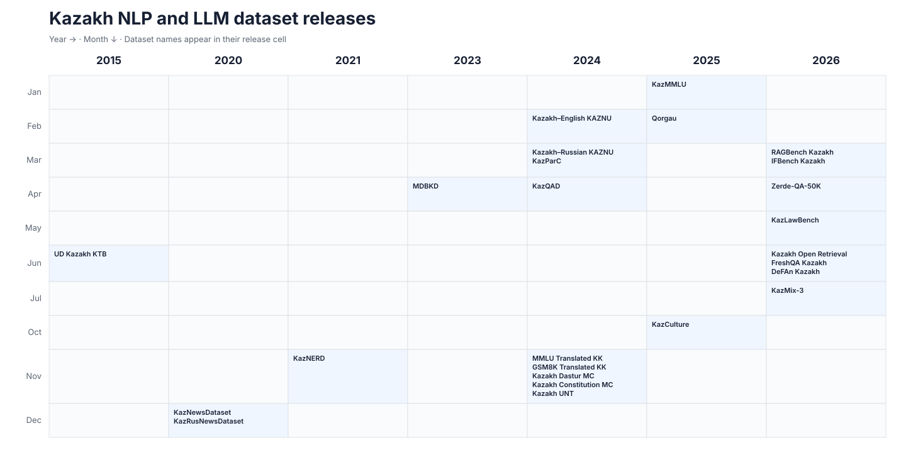
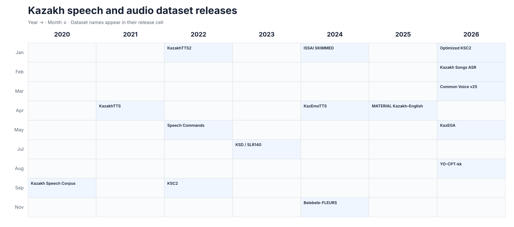
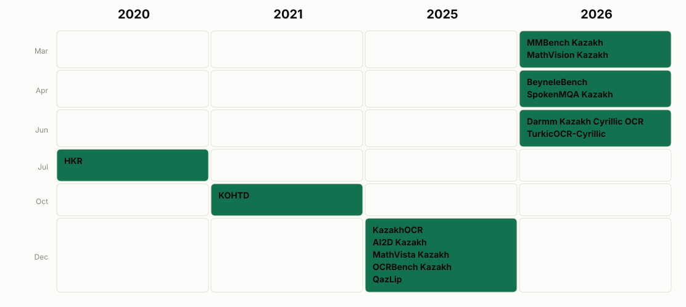

# 🇰🇿 Awesome Kazakh Datasets

A curated list of public datasets that contain substantial Kazakh-language data. Links in **Description** lead to a paper, project page, or dataset card; links in **Download** lead directly to the data repository or archive.

**Storage** is the downloadable or repository-hosted data volume; **Scale** is the number of samples, utterances, hours, or other published content unit. Hugging Face storage values reflect the files hosted in the linked repository and may include multiple configurations; qualifiers identify broader multilingual repositories. Values may change when a living dataset is updated, **≈** denotes a publisher estimate, and **Not reported** is used instead of guessing.

## Text, NLP, and LLM

| Released | Dataset | Description | Download | Storage | Scale | Task |
|---|---|---|---|---:|---:|---|
| 2026-07 | KazMix-3 | [Kazakh instruction mixture (dataset card)](https://huggingface.co/datasets/issai/KazMix-3) | [Files](https://huggingface.co/datasets/issai/KazMix-3/tree/main) | 256.3 MB | 89,775 | Instruction tuning |
| 2026-03 | RAGBench Kazakh | [Kazakh translation of RAGBench (dataset card)](https://huggingface.co/datasets/issai/RAGBench_Kazakh) | [Files](https://huggingface.co/datasets/issai/RAGBench_Kazakh/tree/main) | 58.3 MB | 11,431 | RAG evaluation |
| 2026-03 | IFBench Kazakh | [Kazakh instruction-following benchmark (dataset card)](https://huggingface.co/datasets/issai/IFBench_Kazakh) | [Files](https://huggingface.co/datasets/issai/IFBench_Kazakh/tree/main) | 1.3 MB | 444 | Instruction following |
| 2026-06 | FreshQA Kazakh | [Kazakh FreshQA adaptation (dataset card)](https://huggingface.co/datasets/issai/freshqa_kazakh) | [Files](https://huggingface.co/datasets/issai/freshqa_kazakh/tree/main) | 0.4 MB | 600 | Current-knowledge QA |
| 2026-06 | DeFAn Kazakh | [Kazakh/English decomposition data (dataset card)](https://huggingface.co/datasets/issai/defan_kazakh) | [Files](https://huggingface.co/datasets/issai/defan_kazakh/tree/main) | 0.4 MB | 3,178 total | QA / decomposition |
| 2026-06 | Kazakh Open Retrieval Benchmark | [Benchmark card and methodology](https://huggingface.co/datasets/Tim2190/kaz-rag-search-benchmark) | [Files](https://huggingface.co/datasets/Tim2190/kaz-rag-search-benchmark/tree/main) | 21.1 MB | 300 queries; 8,370 passages | Information retrieval / RAG |
| 2026-05 | KazLawBench | [Kazakh legal benchmark (dataset card)](https://huggingface.co/datasets/raiym76/kazlawbench) | [Files](https://huggingface.co/datasets/raiym76/kazlawbench/tree/main) | 7.6 MB | 3,098 questions | Legal QA / generation |
| 2025-10 | KazCulture | [Human-written Kazakh cultural PQA dataset (dataset card)](https://huggingface.co/datasets/issai/KazCulture) | [Files](https://huggingface.co/datasets/issai/KazCulture/tree/main) | 4.6 MB | 16,137 PQA triplets | Cultural QA |
| 2025-01 | KazMMLU | [Kazakh/Russian regional-knowledge benchmark (paper)](https://arxiv.org/abs/2502.12829) | [Hugging Face](https://huggingface.co/datasets/MBZUAI/KazMMLU) | 17.4 MB | 23,000 total; 10,969 Kazakh | Multiple-choice QA |
| 2025-02 | Qorgau | [Kazakh/Russian LLM-safety benchmark (paper)](https://arxiv.org/abs/2502.13640) | [GitHub](https://github.com/mbzuai-nlp/qorgau-kaz-ru-safety) | 103.9 MB (GitHub repo) | 2,790 prompts | Safety evaluation |
| 2026-04 | Zerde-QA-50K | [Synthetic Kazakh QA collection (dataset card)](https://huggingface.co/datasets/kurumikz/Zerde-QA-50K) | [Files](https://huggingface.co/datasets/kurumikz/Zerde-QA-50K/tree/main) | 156.2 MB | 51,422 pairs | QA / instruction tuning |
| 2024-11 | Kazakh Dastur MC | [Dataset card](https://huggingface.co/datasets/kz-transformers/kazakh-dastur-mc) | [Files](https://huggingface.co/datasets/kz-transformers/kazakh-dastur-mc/tree/main) | 0.3 MB | 1,005 | Multiple-choice QA |
| 2024-11 | Kazakh Constitution MC | [Dataset card](https://huggingface.co/datasets/kz-transformers/kazakh-constitution-mc) | [Files](https://huggingface.co/datasets/kz-transformers/kazakh-constitution-mc/tree/main) | 0.1 MB | 414 | Multiple-choice QA |
| 2024-11 | Kazakh UNT | [Dataset card](https://huggingface.co/datasets/kz-transformers/kazakh-unified-national-testing-mc) | [Files](https://huggingface.co/datasets/kz-transformers/kazakh-unified-national-testing-mc/tree/main) | 4.4 MB | 14,850 | Multiple-choice QA |
| 2024-11 | MMLU Translated KK | [Dataset card](https://huggingface.co/datasets/kz-transformers/mmlu-translated-kk) | [Files](https://huggingface.co/datasets/kz-transformers/mmlu-translated-kk/tree/main) | 11.4 MB | 15,854 | Multiple-choice QA |
| 2024-11 | GSM8K Translated KK | [Dataset card](https://huggingface.co/datasets/kz-transformers/gsm8k-kk-translated) | [Files](https://huggingface.co/datasets/kz-transformers/gsm8k-kk-translated/tree/main) | 4.2 MB | 8,792 | Math reasoning |
| 2024-04 | KazQAD | [Open-domain Kazakh QA (paper)](https://arxiv.org/abs/2404.04487) | [Hugging Face](https://huggingface.co/datasets/issai/kazqad) | 281.7 MB | 6,000 questions; 12,700 passages | Open-domain QA |
| 2024-03 | KazParC | [Kazakh parallel corpus (paper)](https://arxiv.org/abs/2403.19399) | [Hugging Face](https://huggingface.co/datasets/issai/kazparc) · [GitHub](https://github.com/IS2AI/KazParC) | 25.9 GB | 372,000 sentence pairs | Machine translation |
| 2024-03 | Kazakh–Russian KAZNU | [Dataset card](https://huggingface.co/datasets/Dauren-Nur/kaz_rus_parallel_corpora_KAZNU) | [Files](https://huggingface.co/datasets/Dauren-Nur/kaz_rus_parallel_corpora_KAZNU/tree/main) | 23.4 MB | 86,453 pairs | Machine translation |
| 2024-02 | Kazakh–English KAZNU | [Dataset card](https://huggingface.co/datasets/Dauren-Nur/kaz_eng_parallel) | [Files](https://huggingface.co/datasets/Dauren-Nur/kaz_eng_parallel/tree/main) | 196.5 MB | 377,044 pairs | Machine translation |
| 2023-04 | MDBKD | [Multi-domain bilingual Kazakh dataset (dataset card)](https://huggingface.co/datasets/kz-transformers/multidomain-kazakh-dataset) | [Files](https://huggingface.co/datasets/kz-transformers/multidomain-kazakh-dataset/tree/main) | 27.3 GB | 24,883,808 texts | Language modelling |
| 2021-11 | KazNERD | [Kazakh named-entity corpus (paper)](https://arxiv.org/abs/2111.13419) | [Hugging Face](https://huggingface.co/datasets/issai/kaznerd) · [GitHub](https://github.com/IS2AI/KazNERD) | 136.7 MB | 112,702 sentences; 136,333 entity annotations | NER |
| 2020-12 | KazNewsDataset | [Kazakh news corpus (paper)](https://doi.org/10.3390/data6030031) | [Mendeley Data](https://data.mendeley.com/datasets/hwj24p9gkh/1) | Not reported | 4,365 articles | Topic modelling |
| 2020-12 | KazRusNewsDataset | [Kazakh/Russian news corpus (paper)](https://doi.org/10.3390/data6030031) | [Mendeley Data](https://data.mendeley.com/datasets/2vz7vtbhn2/1) | Not reported | 20,409 articles | Text classification |
| 2015-06 | UD Kazakh KTB | [Kazakh Universal Dependencies treebank](https://universaldependencies.org/treebanks/kk_ktb/) | [GitHub](https://github.com/UniversalDependencies/UD_Kazakh-KTB) | 0.4 MB (GitHub repo) | 1,078 sentences; 10,536 tokens | Dependency parsing / POS tagging |

## Speech and audio

### English–Russian–Kazakh comparison by speech task

The bars are conservative lower bounds, not estimates of every dataset in existence. Subsets, mirrors, and known derivatives are excluded. For speaker verification (`*`), a broader speaker-presence rule counts complete multilingual corpora when they explicitly contain speakers of the language; these are **corpus-hours containing the language**, not language-only hours, and possible cross-corpus overlap remains. See the [full source-by-source audit](speech_language_comparison.md) for included datasets, arithmetic, overlaps, exclusions, access conditions, and uncertainty.

| Released | Dataset | Description | Download | Storage | Scale | Task |
|---|---|---|---|---:|---:|---|
| 2026-08 | YO-CPT-kk | [YouTube-oriented Kazakh continual-pretraining corpus (dataset card)](https://huggingface.co/datasets/NCSpeech/YO-CPT-kk) | [Files](https://huggingface.co/datasets/NCSpeech/YO-CPT-kk/tree/main) | 100.0 GB | 600 h; 156,903 utterances | TTS / ASR / speaker verification |
| 2026-01 | Kazakh Speech Dataset (optimized KSC2) | [VAD-sliced and re-transcribed KSC2 derivative (dataset card)](https://huggingface.co/datasets/Flamme-VRM/kazakh-speech-dataset) | [Files](https://huggingface.co/datasets/Flamme-VRM/kazakh-speech-dataset/tree/main) | 54.5 GB | ≈726 h; 230,793 clips | ASR / TTS |
| 2026-02 | Kazakh Songs ASR | [Songs as a source for Kazakh ASR (paper)](https://arxiv.org/abs/2603.00961) | [Hugging Face (gated, non-commercial)](https://huggingface.co/datasets/yeshpanovrustem/kazakh_songs_asr) | 2.9 GB | ≈4.5 h; 3,013 audio–text pairs | Singing voice ASR |
| 2026-05 | KazEGA | [Kazakh emotion, gender, and age speech corpus (dataset card)](https://huggingface.co/datasets/kazega0/KazEGA) | [Files](https://huggingface.co/datasets/kazega0/KazEGA/tree/main) | 38.1 GB | 96,582 utterances | Emotion / gender / age classification |
| 2022-09 | Kazakh Speech Corpus 2 (KSC2) | [Large transcribed Kazakh corpus (dataset card)](https://huggingface.co/datasets/issai/Kazakh_Speech_Corpus_2) | [Files](https://huggingface.co/datasets/issai/Kazakh_Speech_Corpus_2/tree/main) | 80.8 GB | ≈1,200 h; 600,000+ utterances | ASR |
| 2025-04 | MATERIAL Kazakh–English Language Pack | [LDC catalog and documentation](https://catalog.ldc.upenn.edu/LDC2025S03) | [LDC web download (licensed)](https://catalog.ldc.upenn.edu/LDC2025S03) | Not reported | ≈57 h | Speech translation / retrieval |
| 2024-11 | Belebele-FLEURS | [Spoken reading-comprehension benchmark (paper)](https://arxiv.org/abs/2412.08274) | [Hugging Face](https://huggingface.co/datasets/WueNLP/belebele-fleurs) | 223.4 GB (all languages) | 900 Kazakh audio questions | Spoken QA / ASR |
| 2024-04 | KazEmoTTS | [Kazakh emotional TTS corpus (paper)](https://arxiv.org/abs/2404.01033) | [Hugging Face](https://huggingface.co/datasets/issai/KazEmoTTS) · [GitHub](https://github.com/IS2AI/KazEmoTTS) | 10.5 GB | 74.85 h; 54,760 clips | Emotional TTS |
| 2024-01 | ISSAI SKIMMED | [Dataset card](https://huggingface.co/datasets/Dauren-Nur/ISSAI_SKIMMED) | [Files](https://huggingface.co/datasets/Dauren-Nur/ISSAI_SKIMMED/tree/main) | 5.4 GB | 21,617 clips | ASR / TTS |
| 2023-07 | Kazakh Speech Dataset (KSD / SLR140) | [Corpus and paper citation (OpenSLR)](https://openslr.org/140/) | [OpenSLR files](https://openslr.org/140/) · [Hugging Face](https://huggingface.co/datasets/farabi-lab/kazakh-stt) | 141.9 GB | 554 h; 204,250 utterances | ASR |
| 2022-05 | Kazakh Speech Commands | [Project and paper links (GitHub)](https://github.com/IS2AI/Kazakh-Speech-Commands-Dataset) | [Hugging Face](https://huggingface.co/datasets/issai/kazakh-speech-commands) | 267.3 MB | ≈1 h; 3,623 utterances | Keyword spotting |
| 2022-01 | KazakhTTS2 | [Expanded five-speaker Kazakh TTS corpus (paper)](https://arxiv.org/abs/2201.05771) | [ISSAI project and access page](https://issai.nu.edu.kz/tts2-eng/) | 35.7 GB | 271 h; 5 speakers | TTS |
| 2021-04 | KazakhTTS | [Kazakh text-to-speech corpus (paper)](https://arxiv.org/abs/2104.08459) | [Hugging Face](https://huggingface.co/datasets/issai/KazakhTTS) | 11.9 GB | ≈93 h; 42,000 utterances | TTS |
| 2020-09 | Kazakh Speech Corpus (KSC) | [Crowdsourced Kazakh speech corpus (paper)](https://arxiv.org/abs/2009.10334) | [ISSAI download page](https://issai.nu.edu.kz/kz-speech-corpus/) | Not reported | ≈332 h; 153,000 utterances | ASR |
| 2026-03 | Mozilla Common Voice Kazakh | [Common Voice project and current release metadata](https://commonvoice.mozilla.org/en/datasets) | [Mozilla Data Collective](https://commonvoice.mozilla.org/en/datasets) | 76.7 MB (v25) | Not reported for v25 | ASR |

## Vision, OCR, and multimodal

| Released | Dataset | Description | Download | Storage | Scale | Task |
|---|---|---|---|---:|---:|---|
| 2026-04 | BeyneleBench | [Kazakh/English cultural vision benchmark (dataset card)](https://huggingface.co/datasets/issai/BeyneleBench) | [Files](https://huggingface.co/datasets/issai/BeyneleBench/tree/main) | 2.0 GB | 750 | Visual QA |
| 2026-04 | SpokenMQA Kazakh | [Spoken multimodal QA (dataset card)](https://huggingface.co/datasets/issai/SpokenMQA_Kazakh) | [Files](https://huggingface.co/datasets/issai/SpokenMQA_Kazakh/tree/main) | 1.4 GB | 2,256 | Audio-visual QA |
| 2026-03 | MMBench Kazakh | [Kazakh MMBench translation (dataset card)](https://huggingface.co/datasets/issai/MMBench_Kazakh) | [Files](https://huggingface.co/datasets/issai/MMBench_Kazakh/tree/main) | 772.2 MB | 4,329 | Visual QA |
| 2026-03 | MathVision Kazakh | [Kazakh MathVision translation (dataset card)](https://huggingface.co/datasets/issai/MathVision_Kazakh) | [Files](https://huggingface.co/datasets/issai/MathVision_Kazakh/tree/main) | 248.7 MB | 3,040 | Visual math reasoning |
| 2026-06 | Darmm Kazakh Cyrillic OCR | [Synthetic printed-text OCR dataset (dataset card)](https://huggingface.co/datasets/Darmm/darmm-ocr-kazakh-cyrillic) | [Files](https://huggingface.co/datasets/Darmm/darmm-ocr-kazakh-cyrillic/tree/main) | 2.3 GB | 200,000 images | OCR |
| 2026-06 | TurkicOCR-Cyrillic | [TurkicOCR synthetic Cyrillic dataset (dataset card)](https://huggingface.co/datasets/alenisaw/turkicocr-cyrillic) | [Files](https://huggingface.co/datasets/alenisaw/turkicocr-cyrillic/tree/main) | 62.2 GB | 175,000 pages | OCR / Layout analysis / VDU |
| 2025-12 | KazakhOCR | [Three-script synthetic benchmark (paper)](https://aclanthology.org/2026.abjadnlp-1.8.pdf) | [Hugging Face](https://huggingface.co/datasets/henrygagnier/kazakh-ocr) | 15.3 GB | 600 images | OCR evaluation |
| 2025-12 | AI2D Kazakh | [Kazakh diagram-QA translation (dataset card)](https://huggingface.co/datasets/issai/AI2D_Kazakh) | [Files](https://huggingface.co/datasets/issai/AI2D_Kazakh/tree/main) | 465.0 MB | 3,088 | Diagram QA |
| 2025-12 | MathVista Kazakh | [Kazakh MathVista translation (dataset card)](https://huggingface.co/datasets/issai/MathVista_Kazakh) | [Files](https://huggingface.co/datasets/issai/MathVista_Kazakh/tree/main) | 52.6 MB | 1,000 | Visual math reasoning |
| 2025-12 | OCRBench Kazakh | [Kazakh OCR benchmark (dataset card)](https://huggingface.co/datasets/issai/OCRBench-Kazakh) | [Files](https://huggingface.co/datasets/issai/OCRBench-Kazakh/tree/main) | 28.7 MB | 441 | OCR / visual QA |
| 2025-12 | QazLip | [Kazakh lip-movement command corpus (paper)](https://doi.org/10.1038/s41597-025-06193-0) | [Harvard Dataverse](https://doi.org/10.7910/DVN/VIP1J8) | Not reported | ≈34,000 videos; 1.2M frames | Visual speech recognition |
| 2021-10 | KOHTD | [Kazakh Offline Handwritten Text Dataset (paper)](https://arxiv.org/abs/2110.04075) | [GitHub](https://github.com/abdoelsayed2016/KOHTD) | 2.6 MB (GitHub repo) | 3,000 exam papers; 140,335+ segmented images | Handwriting recognition |
| 2020-07 | HKR | [Handwritten Kazakh and Russian database (paper)](https://arxiv.org/abs/2007.03579) | [GitHub and application form](https://github.com/abdoelsayed2016/HKR_Dataset) | Not reported | 1,400+ forms; ≈63,000 sentences (≈5% Kazakh) | Handwriting recognition |

## Inclusion and maintenance

This list favors documented, reusable releases with a stated size. Gated, application-only, and paid research datasets are included when their contents are independently documented and their access status is clearly labeled. It excludes model repositories, duplicate mirrors, unreleased resources, unverifiable uploads, and tiny personal test files. Multilingual resources are included when they expose an identifiable Kazakh split or are explicitly designed for Kazakh evaluation.

### Announced or not yet independently verifiable

- **TilQazyna collections** — numerous text and speech repositories appeared on Hugging Face in June–August 2026, but several are gated and their cards do not yet provide stable totals or independent documentation.
- **Kazakh Text Corpus / Speech Corpus / AI Evaluation Benchmark Suite** — announced in July 2026 as more than 10B text tokens and 10,000 speech hours (including 1,000 manually transcribed hours), but no public dataset download was identified.
- **Multimedia Corpus of Modern Spoken Kazakh Language** — the searchable project exists, but the first module's downloadable size and reuse terms could not be confirmed.

To suggest a dataset, open an issue or pull request with: (1) a description source, (2) a direct download link, (3) a sample count or speech duration, (4) release year, task, and license. Please report changing Hugging Face row counts from the dataset viewer or the [Dataset Server API](https://huggingface.co/docs/dataset-viewer/en/size).

### Abbreviations

- ASR — automatic speech recognition
- IFT — instruction fine-tuning
- NER — named-entity recognition
- PQA — passage–question–answer
- QA — question answering
- RAG — retrieval-augmented generation
- TTS — text to speech
