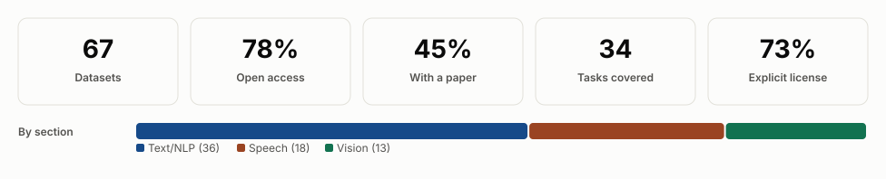
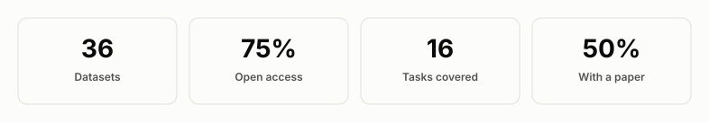
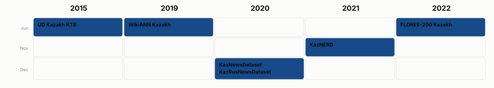
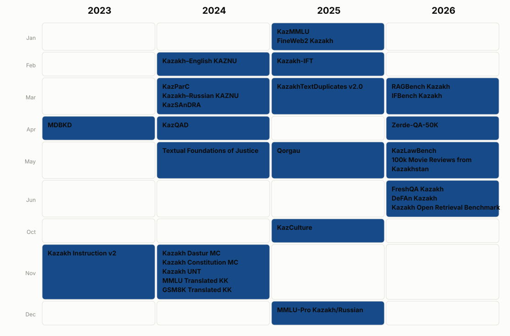
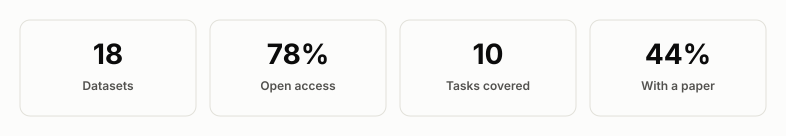
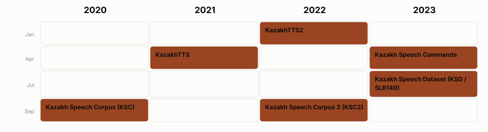
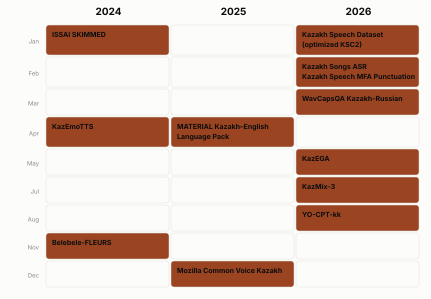
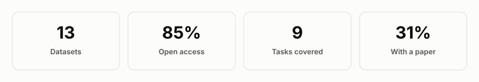

  

<h1 align="center">Awesome Kazakh Datasets</h1>

  A curated, research-grade catalog of public datasets for Kazakh-language NLP, LLM,
  speech, computer vision, OCR, and multimodal research.

<!-- BADGES:START -->

  
  
  
  

<!-- BADGES:END -->

  <a href="#background">Background</a> ·
  <a href="#dataset-landscape">Dataset landscape</a> ·
  <a href="#text-nlp-and-llm">Text &amp; NLP</a> ·
  <a href="#speech-and-audio">Speech</a> ·
  <a href="#vision-ocr-and-multimodal">Vision &amp; OCR</a> ·
  <a href="#watchlist--announced-resources">Watchlist</a> ·
  <a href="#contributing">Contributing</a>

---

## Background

Kazakh is spoken by roughly 13 million people, but public, reusable datasets for
it are scattered across Hugging Face, GitHub, institutional pages, and archives
with no single map of what exists. Existing lists tend to link a dataset card and
stop there — no verified release date, no access terms, no way to tell a genuinely
open corpus from one that is merely described in an open-access paper. A
low-resource language only gets sustained NLP, speech, and vision research when
people can actually find and trust its data — a catalog that quietly links dead
downloads or overstates access just costs everyone time.

This repository tries to fix that: every entry below is checked against its
primary source (the dataset's own hosting platform, not just its rendered card;
the repository; or the paper that introduced it), and its release date, access
terms, and license are recorded rather than assumed. Where a dataset's actual
public release date differs from its Hugging Face "last modified" timestamp or
its paper's submission date — which happens more often than you'd expect — the
primary source wins, and a fact that can't be verified is recorded as *Not
reported* rather than guessed. Resources that are announced but not yet
independently verifiable go in the [Watchlist](#watchlist--announced-resources)
instead of the main tables, so "listed here" reliably means "you can actually get
this data." See [CHANGELOG.md](CHANGELOG.md) for what's new and what was corrected
and why.

In each table, the **Dataset** name links to the dataset card, repository, or
archive, and the **Author** name links to the paper (or the DOI, if there's no
paper) when one is available. **Properties** lists storage — the downloadable or
repository-hosted data volume — followed by scale: the number of samples,
utterances, hours, pages, or other published content unit. Values may change when
a living dataset is updated; **≈** denotes a publisher estimate. See
[CONTRIBUTING.md](CONTRIBUTING.md) for the full inclusion policy, including the
exact meaning of **released** and the access classification.

### Catalog overview

<!-- DASHBOARD:START -->
<picture>
  <source media="(prefers-color-scheme: dark)" srcset="assets/overview_dashboard-dark.svg">
  
</picture>
<!-- DASHBOARD:END -->

## Dataset landscape

<!-- LANDSCAPE:START -->
<picture>
  <source media="(prefers-color-scheme: dark)" srcset="assets/dataset_growth-dark.svg">
  
</picture>

**Datasets per task** — Automatic speech recognition (ASR) (10) · Multiple-choice QA (6) · Question answering (6) · Text-to-speech (TTS) (6) · Machine translation (5) · Language modelling / pretraining (5) · Retrieval / RAG (4) · OCR (4) · Instruction tuning (3) · Legal QA (2) · Named entity recognition (2) · Text classification (2) · Sentiment classification (2) · Emotion / paralinguistic classification (2) · Visual QA (2) · Visual math reasoning (2) · Handwriting recognition (2) · Safety evaluation (1) · Cultural QA (1) · Instruction following (1) · Math reasoning (1) · Dependency parsing / POS tagging (1) · Text deduplication / similarity (1) · Target-speaker ASR / speech separation (1) · Speaker verification (1) · Speech translation (1) · Spoken QA (1) · Keyword spotting (1) · Audio question answering (1) · Cultural vision benchmark (text-to-image) (1) · Audio-visual QA (1) · Layout analysis / document understanding (1) · Diagram QA (1) · Visual speech recognition (lip reading) (1)
<!-- LANDSCAPE:END -->

## Text, NLP, and LLM

<!-- NLP_SECTION:START -->
<picture>
  <source media="(prefers-color-scheme: dark)" srcset="assets/nlp_overview-dark.svg">
  
</picture>

<picture>
  <source media="(prefers-color-scheme: dark)" srcset="assets/nlp_release_calendar_1-dark.svg">
  
</picture>

<picture>
  <source media="(prefers-color-scheme: dark)" srcset="assets/nlp_release_calendar_2-dark.svg">
  
</picture>

**Abbreviations:**

<table>
<tr><td><strong>CQA</strong> — Cultural QA</td><td><strong>IF</strong> — Instruction following</td><td><strong>IFT</strong> — Instruction tuning</td><td><strong>LM</strong> — Language modelling / pretraining</td></tr>
<tr><td><strong>LQA</strong> — Legal QA</td><td><strong>MCQA</strong> — Multiple-choice QA</td><td><strong>MR</strong> — Math reasoning</td><td><strong>MT</strong> — Machine translation</td></tr>
<tr><td><strong>NER</strong> — Named entity recognition</td><td><strong>POS</strong> — Dependency parsing / POS tagging</td><td><strong>QA</strong> — Question answering</td><td><strong>RAG</strong> — Retrieval / RAG</td></tr>
<tr><td><strong>Safety</strong> — Safety evaluation</td><td><strong>SC</strong> — Sentiment classification</td><td><strong>STS</strong> — Text deduplication / similarity</td><td><strong>TC</strong> — Text classification</td></tr>
</table>

| Released | Dataset | Description | Author | Properties |
|---|---|---|---|---|
| 2026-06 | **[FreshQA Kazakh](https://huggingface.co/datasets/issai/freshqa_kazakh)** QA Open · Not reported | Bilingual (English/Kazakh) benchmark of factual questions with false premises, for testing how models handle incorrect assumptions. | **ISSAI researchers** ISSAI, Nazarbayev University | – 0.4 MB – 600 |
| 2026-06 | **[DeFAn Kazakh](https://huggingface.co/datasets/issai/defan_kazakh)** QA Open · MIT | Machine-translated Kazakh/English version of the DefAn hallucination benchmark for definitive question answering. | **ISSAI researchers** ISSAI, Nazarbayev University | – 0.2 MB – 3,178 questions |
| 2026-06 | **[Kazakh Open Retrieval Benchmark](https://huggingface.co/datasets/Tim2190/kaz-rag-search-benchmark)** RAG · QA Open · CC-BY-SA-4.0 | Evidence-based Kazakh information-retrieval benchmark built from Kazakh Wikipedia, showing morphological stemming outperforms multilingual embeddings. | **[Timur Seidalin](https://doi.org/10.5281/zenodo.20605663)** | – 14.6 MB – 300 queries; 8,370 passages |
| 2026-05 | **[KazLawBench](https://huggingface.co/datasets/raiym76/kazlawbench)** LQA Gated · CC-BY-NC-SA-4.0 | First bilingual (Russian + Kazakh) legal-LLM benchmark for Kazakhstan, spanning statutory codes and de-identified Supreme Court judgments across seven task types. | **Batyr Raiym** | – 9.9 MB – 3,098 |
| 2026-05 | **[100k Movie Reviews from Kazakhstan](https://huggingface.co/datasets/yeshpanovrustem/100k_movie_reviews_from_kz)** SC Gated · CC-BY-4.0 | 100,502 kino.kz movie reviews (2001-2025) manually annotated for language ID and sentiment, capturing Russian, Kazakh, and code-switched Kazakh-Russian text. | **[Rustem Yeshpanov](https://arxiv.org/abs/2605.08600)** | – 57.7 MB – 100,502 reviews |
| 2026-04 | **[Zerde-QA-50K](https://huggingface.co/datasets/kurumikz/Zerde-QA-50K)** IFT · QA Open · ODC-By-1.0 | Synthetic Kazakh QA collection spanning 20+ academic domains for instruction tuning and low-resource NLP research. | **kurumikz** | – 156.2 MB – 51,422 pairs |
| 2026-03 | **[RAGBench Kazakh](https://huggingface.co/datasets/issai/RAGBench_Kazakh)** RAG Open · CC-BY-4.0 | Kazakh translation of RAGBench for evaluating retrieval-augmented-generation systems across biomedical, legal, financial, and general-knowledge domains. | **ISSAI researchers** ISSAI, Nazarbayev University | – 31.2 MB – 11,431 |
| 2026-03 | **[IFBench Kazakh](https://huggingface.co/datasets/issai/IFBench_Kazakh)** IF Open · Apache-2.0 | Machine-translated Kazakh instruction-following benchmark evaluating adherence to explicit constraints. | **ISSAI researchers** ISSAI, Nazarbayev University | – 1.3 MB – 444 |
| 2025-12 | **[MMLU-Pro Kazakh/Russian](https://huggingface.co/datasets/issai/MMLU-Pro_Kazakh_Russian)** MCQA Open · MIT | Machine-translated Kazakh/Russian version of MMLU-Pro, with more answer options and more challenging reasoning tasks than MMLU. | **ISSAI researchers** ISSAI, Nazarbayev University | – 11.4 MB – 24,064 rows; 12k per language |
| 2025-10 | **[KazCulture](https://huggingface.co/datasets/issai/KazCulture)** CQA Gated · CC-BY-4.0 | Human-written passage-question-answer triplets covering Kazakh traditions, music, beliefs, cuisine, games, clothing, and handicrafts. | **ISSAI researchers** ISSAI, Nazarbayev University | – 4.6 MB – 16,137 PQA triplets |
| 2025-05 | **[Qorgau](https://github.com/mbzuai-nlp/qorgau-kaz-ru-safety)** Safety Open · Not reported | Kazakh/Russian bilingual LLM-safety evaluation benchmark spanning six high-level risk areas and 17 harm types. | **[MBZUAI NLP group](https://arxiv.org/abs/2502.13640)** MBZUAI | – 103.9 MB – 2,790 prompts |
| 2025-03 | **[KazakhTextDuplicates v2.0](https://huggingface.co/datasets/Arailym-tleubayeva/KazakhTextDuplicates)** STS Open · CC-BY-4.0 | Controlled multi-regime benchmark for semantic deduplication, semantic similarity, and retrieval in Kazakh, with seven deterministic duplication regimes. | **[Arailym Tleubayeva](https://www.mdpi.com/2306-5729/11/6/133)** | – 217 MB – 25,922 rows |
| 2025-02 | **[Kazakh-IFT](https://huggingface.co/datasets/nurkhan5l/kazakh-ift)** IFT Gated · CC-BY-NC-SA-4.0 | Instruction-following dataset covering Kazakhstani governance, legal process, cultural practice, and public-service knowledge, LLM-generated with GPT-4o. | **[Laiyk et al.](https://arxiv.org/abs/2502.13647)** MBZUAI | – 7.85 MB – ~10,600 samples |
| 2025-01 | **[KazMMLU](https://huggingface.co/datasets/MBZUAI/KazMMLU)** MCQA Open · CC-BY-NC-SA-4.0 | Kazakh/Russian multiple-choice benchmark covering regional knowledge of Kazakhstan across school and university subjects. | **[Togmanov et al.](https://arxiv.org/abs/2502.12829)** MBZUAI | – 17.4 MB – 23,000 total; 10,969 Kazakh |
| 2025-01 | **[FineWeb2 Kazakh](https://huggingface.co/datasets/HuggingFaceFW/fineweb-2/viewer/kaz_Cyrl)** LM Open · ODC-By-1.0 | Kazakh (kaz_Cyrl) configuration of FineWeb2, a deduplicated, quality-filtered multilingual web-crawl pretraining corpus. | **Hugging Face FineWeb team** Hugging Face | – 3,380,000 rows (kaz_Cyrl) |
| 2024-11 | **[Kazakh Dastur MC](https://huggingface.co/datasets/kz-transformers/kazakh-dastur-mc)** MCQA Open · Apache-2.0 | Multiple-choice benchmark on Kazakh traditions and customs (dastur). | **kz-transformers** | – 0.3 MB – 1,005 |
| 2024-11 | **[Kazakh Constitution MC](https://huggingface.co/datasets/kz-transformers/kazakh-constitution-mc)** MCQA Open · Apache-2.0 | Multiple-choice benchmark on the Constitution of the Republic of Kazakhstan. | **kz-transformers** | – 0.1 MB – 414 |
| 2024-11 | **[Kazakh UNT](https://huggingface.co/datasets/kz-transformers/kazakh-unified-national-testing-mc)** MCQA Open · Apache-2.0 | Multiple-choice benchmark built from the Kazakh Unified National Testing exam. | **kz-transformers** | – 4.4 MB – 14,850 |
| 2024-11 | **[MMLU Translated KK](https://huggingface.co/datasets/kz-transformers/mmlu-translated-kk)** MCQA Open · Apache-2.0 | Machine-translated Kazakh version of MMLU. | **kz-transformers** | – 11.4 MB – 15,854 |
| 2024-11 | **[GSM8K Translated KK](https://huggingface.co/datasets/kz-transformers/gsm8k-kk-translated)** MR Open · Apache-2.0 | Machine-translated Kazakh version of GSM8K grade-school math word problems. | **kz-transformers** | – 4.2 MB – 8,792 |
| 2024-05 | **[Textual Foundations of Justice](https://data.mendeley.com/datasets/jdpc5658nh/3)** LQA · LM Open · CC-BY-4.0 | All current laws of the Republic of Kazakhstan as of 2024-04-01, in Russian and Kazakh, for legal-QA model training. | **[Akhmetov et al.](https://doi.org/10.17632/jdpc5658nh.3)** Kazakh-British Technical University | Not reported |
| 2024-04 | **[KazQAD](https://huggingface.co/datasets/issai/kazqad)** QA · RAG Gated · CC-BY-SA-4.0 | Kazakh open-domain QA dataset supporting reading comprehension, full ODQA, and information-retrieval settings, built from translated Natural Questions and the Kazakh UNT exam. | **[Yeshpanov et al.](https://arxiv.org/abs/2404.04487)** ISSAI, Nazarbayev University | – 281.7 MB – 6,000 questions; 12,700 passages |
| 2024-03 | **[KazParC](https://huggingface.co/datasets/issai/kazparc)** MT Gated · Not reported | Kazakh parallel corpus covering Kazakh, English, Russian, and Turkish across proverbs, literature, news, TED talks, legal documents, and UN publications, plus a large synthetic (SynC) extension. | **[ISSAI researchers](https://arxiv.org/abs/2403.19399)** ISSAI, Nazarbayev University | – 25.9 GB – 372,000 sentence pairs (+ 1.8M synthetic) |
| 2024-03 | **[Kazakh–Russian KAZNU](https://huggingface.co/datasets/Dauren-Nur/kaz_rus_parallel_corpora_KAZNU)** MT Open · Not reported | Parallel Kazakh-Russian corpus of governmental and official documents. | **Dauren-Nur** Al-Farabi Kazakh National University | – 23.4 MB – 86,453 pairs |
| 2024-03 | **[KazSAnDRA](https://huggingface.co/datasets/issai/kazsandra)** SC Gated · CC-BY-4.0 | Kazakh Sentiment Analysis Dataset of Reviews and Attitudes, with numerically rated reviews supporting polarity and score classification. | **[ISSAI researchers](https://arxiv.org/abs/2403.19335)** ISSAI, Nazarbayev University | – 108 MB – 180,064 reviews |
| 2024-02 | **[Kazakh–English KAZNU](https://huggingface.co/datasets/Dauren-Nur/kaz_eng_parallel)** MT Open · Not reported | Parallel Kazakh-English corpus collected from law documents and news sites. | **Al-Farabi Kazakh National University researchers** Al-Farabi Kazakh National University | – 70.6 MB – 377,044 pairs |
| 2023-11 | **[Kazakh Instruction v2](https://huggingface.co/datasets/AmanMussa/kazakh-instruction-v2)** IFT · QA Open · MIT | Kazakh instruction dataset built by machine-translating Stanford Alpaca with manual correction and added Kazakhstani names, places, history, and culture instructions. | **Mussa & Mansurova** Al-Farabi Kazakh National University | – 35.6 MB – 52,201 rows |
| 2023-04 | **[MDBKD](https://huggingface.co/datasets/kz-transformers/multidomain-kazakh-dataset)** LM Open · Apache-2.0 | Multi-Domain Bilingual Kazakh Dataset combining CC100, Kazakh Wikipedia, kazakhBooks, Leipzig news, OSCAR CommonCrawl, and kazakhNews sources. | **[Sagyndyk et al.](https://doi.org/10.36227/techrxiv.175942902.25827042/v1)** kz-transformers | – 24.7 GB – 24,883,808 texts; 2.09B tokens |
| 2022-06 | **[FLORES-200 Kazakh](https://huggingface.co/datasets/facebook/flores)** MT Open · CC-BY-SA-4.0 | Kazakh (kaz_Cyrl) sentences within FLORES-200, a 200-language many-to-many machine-translation evaluation benchmark of professionally translated Wikipedia sentences. | **NLLB / FLORES team** Meta AI | – 3,001 sentences (dev + devtest) |
| 2021-11 | **[KazNERD](https://huggingface.co/datasets/issai/kaznerd)** NER Gated · CC-BY-4.0 | Kazakh named-entity corpus of 112,702 sentences from television news text, annotated with 25 entity classes using IOB2. | **[Yeshpanov et al.](https://aclanthology.org/2022.lrec-1.44)** ISSAI, Nazarbayev University | – 136.7 MB – 112,702 sentences; 136,333 entity annotations |
| 2020-12 | **[KazNewsDataset](https://data.mendeley.com/datasets/hwj24p9gkh/1)** TC · LM Open · CC-BY-4.0 | Kazakhstani news corpus for social-significance identification with topic-modelling results, from open Kazakhstani news media and governmental development programs. | **[Yakunin et al.](https://doi.org/10.3390/data6030031)** | – 1,142,735 documents |
| 2020-12 | **[KazRusNewsDataset](https://data.mendeley.com/datasets/2vz7vtbhn2/1)** TC Open · CC-BY-4.0 | Kazakhstani and Russian news corpus collected via web scraping from open Kazakhstani and Russian media. | **[Yakunin et al.](https://doi.org/10.3390/data6030031)** | – 6,261,953 documents |
| 2019-06 | **[WikiANN Kazakh](https://huggingface.co/datasets/unimelb-nlp/wikiann)** NER Open · Not reported | Kazakh (kk) split of WikiANN / PAN-X, a Wikipedia-derived multilingual named-entity-recognition dataset with LOC/PER/ORG IOB2 tags. | **Rahimi et al.** | – Not reported (kk split) |
| 2015-06 | **[UD Kazakh KTB](https://universaldependencies.org/treebanks/kk_ktb/)** POS Open · CC-BY-SA-4.0 | Kazakh Universal Dependencies treebank drawn from Wikipedia, folk tales, the UDHR, news, and phrasebook sentences. | **Makazhanov et al.** Universal Dependencies | – 0.4 MB – 1,078 sentences; 10,536 tokens |
| Not reported | **[kaz-text-for-lm-normalized](https://huggingface.co/datasets/farabi-lab/kaz-text-for-lm-normalized)** LM Gated · Not reported | Normalized Kazakh language-modelling corpus combining news, literature, academic/dissertation text, and an August-2024 Kazakh Wikipedia snapshot. | **Al-Farabi Kazakh National University** | – 5.99 GB |
| Not reported | **[Uzbek-Kazakh Parallel Corpora](https://huggingface.co/datasets/Sanatbek/uzbek-kazakh-parallel-corpora)** MT Open · Not reported | Expert-translated Uzbek-Kazakh parallel sentence corpus covering literature and web news. | **[Sanatbek](https://doi.org/10.57967/hf/1748)** | – 34.2 MB – 133,877 pairs |
<!-- NLP_SECTION:END -->

## Speech and audio

<!-- SPEECH_SECTION:START -->
<picture>
  <source media="(prefers-color-scheme: dark)" srcset="assets/speech_overview-dark.svg">
  
</picture>

<picture>
  <source media="(prefers-color-scheme: dark)" srcset="assets/speech_release_calendar_1-dark.svg">
  
</picture>

<picture>
  <source media="(prefers-color-scheme: dark)" srcset="assets/speech_release_calendar_2-dark.svg">
  
</picture>

**Abbreviations:**

<table>
<tr><td><strong>AQA</strong> — Audio question answering</td><td><strong>ASR</strong> — Automatic speech recognition (ASR)</td><td><strong>EPC</strong> — Emotion / paralinguistic classification</td><td><strong>KWS</strong> — Keyword spotting</td></tr>
<tr><td><strong>RAG</strong> — Retrieval / RAG</td><td><strong>SQA</strong> — Spoken QA</td><td><strong>ST</strong> — Speech translation</td><td><strong>SV</strong> — Speaker verification</td></tr>
<tr><td><strong>TS-ASR</strong> — Target-speaker ASR / speech separation</td><td><strong>TTS</strong> — Text-to-speech (TTS)</td><td></td><td></td></tr>
</table>

| Released | Dataset | Description | Author | Properties |
|---|---|---|---|---|
| 2026-08 | **[YO-CPT-kk](https://huggingface.co/datasets/NCSpeech/YO-CPT-kk)** ASR · TTS · SV Open · custom (yo-cpt-kk) | YouTube-oriented Kazakh continual-pretraining corpus spanning TTS-grade, ASR, and speaker-verification use cases. | **NCSpeech** | – 100.0 GB – 600 h; 156,903 utterances |
| 2026-07 | **[KazMix-3](https://huggingface.co/datasets/issai/KazMix-3)** TS-ASR Open · CC-BY-4.0 | Kazakh three-speaker overlapping-speech dataset for target-speaker ASR, released with the Persona-ASR project; mixtures derived from KSD/SLR140 with enrollment utterances. | **ISSAI researchers** ISSAI, Nazarbayev University | – 256.3 MB – 89,775 rows (62.8k/13.5k/13.5k splits) |
| 2026-05 | **[KazEGA](https://huggingface.co/datasets/kazega0/KazEGA)** EPC Gated · CC-BY-NC-4.0 | Kazakh speech corpus for paralinguistic classification, annotated for emotion (7 classes), gender, and age group; source audio extracted from YouTube. | **kazega0** | – 38.1 GB – 96,582 utterances |
| 2026-03 | **[WavCapsQA Kazakh-Russian](https://huggingface.co/datasets/issai/WavCapsQA_Kazakh_Russian)** AQA Open · Not reported | Machine-translated Kazakh/Russian adaptation of the WavCaps-QA test set for audio question answering over environmental sounds, music, and ambient scenes. | **ISSAI researchers** ISSAI, Nazarbayev University | – 189 MB – 608 rows (304 Kazakh, 304 Russian) |
| 2026-02 | **[Kazakh Songs ASR](https://huggingface.co/datasets/yeshpanovrustem/kazakh_songs_asr)** ASR Gated · custom (non-commercial) | Manually aligned Kazakh vocal-audio segments from commercially released songs, for studying whether sung speech improves low-resource ASR. | **[Rustem Yeshpanov](https://arxiv.org/abs/2603.00961)** | – 2.9 GB – ≈4.5 h; 3,013 audio-text pairs (195 songs, 36 artists) |
| 2026-02 | **[Kazakh Speech MFA Punctuation](https://huggingface.co/datasets/govnejri/kazakh_speech_mfa_punctuation)** ASR Open · Not reported | Punctuation-restored, word-level-timestamped derivative of ISSAI KSC2, force-aligned with the Montreal Forced Aligner. | **Bekzat Uteulin** Jeti Labs | – 56.8 GB – 408,010 utterances; ≈1,110 h |
| 2026-01 | **[Kazakh Speech Dataset (optimized KSC2)](https://huggingface.co/datasets/Flamme-VRM/kazakh-speech-dataset)** ASR · TTS Open · CC-BY-4.0 | VAD-sliced and Whisper-Turbo re-transcribed derivative of KSC2 with quality filtering. | **Flamme-VRM** | – 54.5 GB – ≈726 h; 230,793 clips |
| 2025-12 | **[Mozilla Common Voice Kazakh](https://datacollective.mozillafoundation.org/datasets/cmj8u3pbb00dhnxxbsqe4vbpc)** ASR Open · CC0-1.0 | Crowdsourced Kazakh voice recordings from the Common Voice Scripted Speech project. | **Mozilla Foundation** Mozilla Foundation | – 2,750 clips; 3.76 h recorded (2.39 h validated); 193 speakers |
| 2025-04 | **[MATERIAL Kazakh–English Language Pack](https://catalog.ldc.upenn.edu/LDC2025S03)** ST · RAG Paid · LDC membership / subscription tiers | Kazakh conversational telephone speech with English translations, transcripts, and query-relevance annotations, from Northern and Southern Kazakh dialect regions. | **Appen (for IARPA MATERIAL)** IARPA MATERIAL program | – ≈57 h |
| 2024-11 | **[Belebele-FLEURS](https://huggingface.co/datasets/WueNLP/belebele-fleurs)** SQA · ASR Open · CC-BY-SA-4.0 | Spoken reading-comprehension benchmark combining Belebele and FLEURS audio/text across 99 languages. | **WüNLP** | – 3.4 GB – 870 Kazakh test examples |
| 2024-04 | **[KazEmoTTS](https://huggingface.co/datasets/issai/KazEmoTTS)** TTS · EPC Application · Not reported | Kazakh emotional TTS corpus with six emotion classes (neutral, angry, happy, sad, scared, surprised) across male and female narrators. | **[Abilbekov et al.](https://arxiv.org/abs/2404.01033)** ISSAI, Nazarbayev University | – 10.5 GB – 74.85 h; 54,760 clips |
| 2024-01 | **[ISSAI SKIMMED](https://huggingface.co/datasets/Dauren-Nur/ISSAI_SKIMMED)** ASR · TTS Open · Not reported | Multimodal Kazakh audio-transcription dataset with train/test/dev splits. | **Dauren-Nur** | – 5.4 GB – 21,617 clips |
| 2023-07 | **[Kazakh Speech Dataset (KSD / SLR140)](https://openslr.org/140/)** ASR Open · CC-BY-SA-3.0 | Open-source Kazakh speech corpus recorded on mobile devices across diverse regions, ages, and genders, verified by native speakers. | **[Mansurova & Kadyrbek](https://doi.org/10.3390/bdcc7030132)** Dept. of AI and Big Data, Al-Farabi Kazakh National University | – 56 GB – 554 h; 204,250 utterances |
| 2023-04 | **[Kazakh Speech Commands](https://huggingface.co/datasets/issai/kazakh-speech-commands)** KWS Open · Apache-2.0 | Kazakh speech-command recognition dataset built via synthetic TTS generation and speech-corpus scraping, with data augmentation. | **[Kuzdeuov et al.](https://ieeexplore.ieee.org/document/10601292)** IS2AI | – 267.3 MB – ≈1 h; 3,623 utterances |
| 2022-09 | **[Kazakh Speech Corpus 2 (KSC2)](https://huggingface.co/datasets/issai/Kazakh_Speech_Corpus_2)** ASR Open · MIT | Industrial-scale open-source Kazakh speech corpus subsuming KSC and KazakhTTS2, with additional TV, radio, senate, and podcast data, including Kazakh-Russian code-switching. | **[Mussakhojayeva et al.](https://www.isca-archive.org/interspeech_2022/mussakhojayeva22_interspeech.html)** ISSAI, Nazarbayev University | – 80.8 GB – ≈1,200 h; 600,000+ utterances |
| 2022-01 | **[KazakhTTS2](https://issai.nu.edu.kz/tts2-eng/)** TTS Open · Not reported | Expanded five-speaker Kazakh TTS corpus, extending the original KazakhTTS with more data, speakers, and topics. | **[ISSAI researchers](https://arxiv.org/abs/2201.05771)** ISSAI, Nazarbayev University | – 35.7 GB – 271 h; 5 speakers |
| 2021-04 | **[KazakhTTS](https://huggingface.co/datasets/issai/KazakhTTS)** TTS Open · Not reported | Open-source Kazakh text-to-speech corpus, later expanded by KazakhTTS2. | **[Mussakhojayeva et al.](https://aclanthology.org/2022.lrec-1.578.pdf)** ISSAI, Nazarbayev University | – 11.9 GB – ≈93 h; 42,000 utterances |
| 2020-09 | **[Kazakh Speech Corpus (KSC)](https://issai.nu.edu.kz/kz-speech-corpus/)** ASR Open · CC-BY-4.0 | Crowdsourced Kazakh speech corpus with an initial ASR baseline. | **[ISSAI researchers](https://arxiv.org/abs/2009.10334)** ISSAI, Nazarbayev University | – ≈332 h; 153,000 utterances |
<!-- SPEECH_SECTION:END -->

### English-Russian-Kazakh comparison by speech task

<picture>
  <source media="(prefers-color-scheme: dark)" srcset="assets/speech_task_hours_comparison-dark.svg">
  
</picture>

The bars are conservative lower bounds, not estimates of every dataset in existence.
Subsets, mirrors, and known derivatives are excluded. For speaker verification (`*`),
a broader speaker-presence rule counts complete multilingual corpora when they
explicitly contain speakers of the language; these are **corpus-hours containing the
language**, not language-only hours, and possible cross-corpus overlap remains.

## Vision, OCR, and multimodal

<!-- VISION_SECTION:START -->
<picture>
  <source media="(prefers-color-scheme: dark)" srcset="assets/vision_overview-dark.svg">
  
</picture>

<picture>
  <source media="(prefers-color-scheme: dark)" srcset="assets/cv_release_calendar-dark.svg">
  
</picture>

**Abbreviations:**

<table>
<tr><td><strong>AVQA</strong> — Audio-visual QA</td><td><strong>DQA</strong> — Diagram QA</td><td><strong>DU</strong> — Layout analysis / document understanding</td><td><strong>HTR</strong> — Handwriting recognition</td></tr>
<tr><td><strong>OCR</strong> — OCR</td><td><strong>T2I</strong> — Cultural vision benchmark (text-to-image)</td><td><strong>VMR</strong> — Visual math reasoning</td><td><strong>VQA</strong> — Visual QA</td></tr>
<tr><td><strong>VSR</strong> — Visual speech recognition (lip reading)</td><td></td><td></td><td></td></tr>
</table>

| Released | Dataset | Description | Author | Properties |
|---|---|---|---|---|
| 2026-06 | **[Darmm Kazakh Cyrillic OCR](https://huggingface.co/datasets/Darmm/darmm-ocr-kazakh-cyrillic)** OCR Open · Apache-2.0 | Synthetic printed-text OCR dataset for Kazakh Cyrillic, rendered from Kazakh Wikipedia text with Kazakh-specific characters (Ә, Ғ, Қ, Ң, Ө, Ұ, Ү, Һ, І). | **Rakhat Zhumabek** | – 2.3 GB – 200,000 images (100k word-level + 100k line-level) |
| 2026-06 | **[TurkicOCR-Cyrillic](https://huggingface.co/datasets/alenisaw/turkicocr-cyrillic)** OCR · DU Open · CC-BY-4.0 | Synthetic Turkic-Cyrillic OCR dataset spanning Kazakh, Kyrgyz, Kazakh-Russian, and Kyrgyz-Russian text and layouts. | **Alen Issayev** | – 66.7 GB – 100,000 unique pages; 175,000 nested-config rows |
| 2026-04 | **[BeyneleBench](https://huggingface.co/datasets/issai/BeyneleBench)** T2I Open · CC-BY-4.0 | Kazakh/English benchmark for cultural fidelity in text-to-image generation, pairing prompts with reference images and cultural taxonomy levels. | **ISSAI researchers** ISSAI, Nazarbayev University | – 2.0 GB – 750 |
| 2026-04 | **[SpokenMQA Kazakh](https://huggingface.co/datasets/issai/SpokenMQA_Kazakh)** AVQA Open · Not reported | Machine-translated Kazakh adaptation of SpokenMQA for evaluating spoken mathematical reasoning in speech/audio-language models. | **ISSAI researchers** ISSAI, Nazarbayev University | – 1.4 GB – 2,256 |
| 2026-03 | **[MMBench Kazakh](https://huggingface.co/datasets/issai/MMBench_Kazakh)** VQA Open · Not reported | Kazakh translation of the MMBench validation split, evaluating perception, reasoning, and logic via multiple-choice VQA. | **ISSAI researchers** ISSAI, Nazarbayev University | – 772.2 MB – 4,329 |
| 2026-03 | **[MathVision Kazakh](https://huggingface.co/datasets/issai/MathVision_Kazakh)** VMR Open · MIT | Machine-translated MathVision dataset for evaluating mathematical reasoning and visual understanding in multimodal LLMs. | **ISSAI researchers** ISSAI, Nazarbayev University | – 248.7 MB – 3,040 |
| 2025-12 | **[KazakhOCR](https://huggingface.co/datasets/henrygagnier/kazakh-ocr)** OCR Open · MIT | Synthetic benchmark for evaluating multimodal models on Arabic-, Cyrillic-, and Latin-script Kazakh OCR. | **[Gagnier et al.](https://aclanthology.org/2026.abjadnlp-1.8/)** | – 15.3 GB – 600 images |
| 2025-12 | **[AI2D Kazakh](https://huggingface.co/datasets/issai/AI2D_Kazakh)** DQA Open · Not reported | Kazakh translation of AI2D diagram-question-answering data. | **ISSAI researchers** ISSAI, Nazarbayev University | – 465.0 MB – 3,088 |
| 2025-12 | **[MathVista Kazakh](https://huggingface.co/datasets/issai/MathVista_Kazakh)** VMR Open · CC-BY-SA-4.0 | Kazakh translation of MathVista for visual math reasoning. | **ISSAI researchers** ISSAI, Nazarbayev University | – 52.6 MB – 1,000 |
| 2025-12 | **[OCRBench Kazakh](https://huggingface.co/datasets/issai/OCRBench-Kazakh)** OCR · VQA Open · Apache-2.0 | Kazakh OCR and visual-QA benchmark translated from OCRBench. | **ISSAI researchers** ISSAI, Nazarbayev University | – 28.7 MB – 441 |
| 2025-12 | **[QazLip](https://doi.org/10.7910/DVN/VIP1J8)** VSR Open · Not reported | Kazakh lip-movement command corpus of 102 nouns recorded from 26 participants at 1080p/60fps for visual speech recognition. | **[Zhalgas, A. et al.](https://doi.org/10.1038/s41597-025-06193-0)** | – ≈34,000 videos; 1.2M frames |
| 2021-10 | **[KOHTD](https://github.com/abdoelsayed2016/KOHTD)** HTR Application · CC-BY-NC-ND-4.0 | Kazakh Offline Handwritten Text Dataset of exam papers (99% Kazakh, 1% Russian). | **[Toiganbayeva et al.](https://doi.org/10.1016/j.image.2022.116827)** Satbayev University · Al-Farabi Kazakh National University | – 2.6 MB – 3,000 exam papers; 140,335+ segmented images; ≈922,010 symbols |
| 2020-07 | **[HKR](https://github.com/abdoelsayed2016/HKR_Dataset)** HTR Application · CC-BY-NC-ND-4.0 | Handwritten Kazakh and Russian database (HKR), predominantly Russian (≈95%) with a Kazakh minority share (≈5%). | **[Nurseitov et al.](https://doi.org/10.1007/s11042-021-11399-6)** | – 1,400+ forms; ≈63,000 sentences; ≈715,699 symbols (≈5% Kazakh) |
<!-- VISION_SECTION:END -->

## Watchlist / announced resources

Resources below are announced, described in a paper without a public artifact,
license-conflicted, or not yet independently verifiable as usable Kazakh-language
datasets. They are intentionally **not** part of the main catalog above.

<!-- WATCHLIST:START -->
- **KazBench-KK** — A 7,111-question cultural-knowledge benchmark introduced at the Fourth Workshop on NLP Applications to Field Linguistics (August 2025). No public dataset download, GitHub repository, or Hugging Face card could be located from the paper — only the [ACL Anthology paper](https://aclanthology.org/2025.fieldmatters-1.4/) is verifiable.
- **Zerde-QA-Wiki-20K** — Referenced as a candidate Kazakh Wikipedia-QA release; no dataset card, repository, or download under this name could be independently verified.
- **TilQazyna collections** — Numerous text and speech repositories appeared on Hugging Face in June-August 2026, but several are gated and their cards do not yet provide stable totals or independent documentation.
- **Kazakh Text Corpus / Speech Corpus / AI Evaluation Benchmark Suite** — Announced in July 2026 as more than 10B text tokens and 10,000 speech hours (including 1,000 manually transcribed hours), but no public dataset download was identified.
- **Multimedia Corpus of Modern Spoken Kazakh Language** — The searchable project exists, but the first module's downloadable size and reuse terms could not be confirmed.
- **Aqbileq** — Named as a candidate Kazakh resource; no dataset card, repository, or paper could be independently located under this name.
<!-- WATCHLIST:END -->

## Inclusion and maintenance

This catalog excludes model repositories, duplicate mirrors, tokenizer-format
conversions, and tiny personal test files. Gated, application-only, and paid
research datasets are still included as long as their contents are
independently documented and their access status is clearly labeled.
Multilingual resources are included only when they expose a genuinely
accessible, identifiable Kazakh split. Full inclusion, exclusion, and
verification rules are in [CONTRIBUTING.md](CONTRIBUTING.md).

## Contributing

Missing a Kazakh dataset, or spotted outdated metadata? Contributions are welcome:

- **Add a dataset** — [open a submission issue](../../issues/new?template=dataset-submission.yml)
  or send a PR directly.
- **Fix or update an entry** — edit `data/datasets.yaml` and open a PR.
- **Report a stale number** — Hugging Face row/download counts drift; flag it
  with the current value from the
  [Dataset Server API](https://huggingface.co/docs/dataset-viewer/en/size).

See [CONTRIBUTING.md](CONTRIBUTING.md) for the full inclusion criteria, required
metadata, and PR format.
